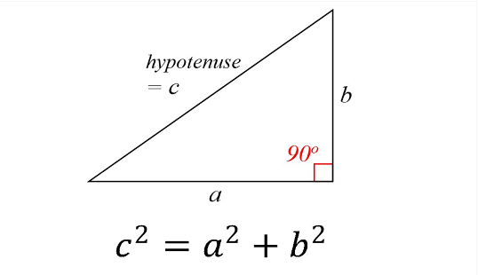
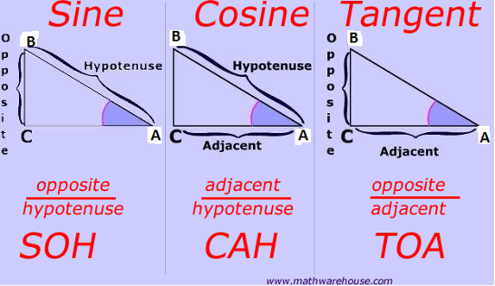
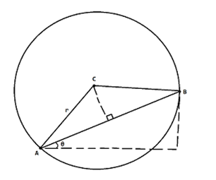

slidenumbers: true
slidecount: true
autoscale: true
slide-transition: true
build-lists: true

# Welcome to CS2030 Lab 1!
## 28 January 2021 [10J]

![inline](data:image/png;base64,iVBORw0KGgoAAAANSUhEUgAABHQAAAR0CAYAAAAQDEG2AAAAAXNSR0IArs4c6QAAAARnQU1BAACxjwv8YQUAAAAJcEhZcwAADsMAAA7DAcdvqGQAANMFSURBVHhe7NhBriRJsizZv/9Nd89qRAFYgPilc4jyAWjMCjG/UYX8f//fzMzMzMzMzMz8U/YfdGZmZmZmZmZm/jH7DzozMzMzMzMzM/+Y/QedmZmZmZmZmZl/zP6DzszMzMzMzMzMP2b/QWdmZmZmZmZm5h+z/6AzMzMzMzMzM/OP2X/QmZmZmZmZmZn5x+w/6MzMzMzMzMzM/GP2H3RmZmZmZmZmZv4x+w86MzMzMzMzMzP/mP0HnZmZmZmZmZmZf8z+g87MzMzMzMzMzD9m/0FnZmZmZmZmZuYfs/+gMzMzMzMzMzPzj9l/0JmZmZmZmZmZ+cfsP+jMzMzMzMzMzPxj9h90ZmZmZmZmZmb+MfsPOjMzMzMzMzMz/5j9B52ZmZmZmZmZmX/M/oPOzMzMzMzMzMw/Zv9BZ2ZmZmZmZmbmH7P/oDMzMzMzMzMz84/Zf9CZmZmZmZmZmfnH7D/ozMzMzMzMzMz8Y/YfdGZmZmZmZmZm/jH7DzozMzMzMzMzM/+Y/QedmZmZmZmZmZl/zP6DzszMzMzMzMzMP2b/QWdmZmZmZmZm5h+z/6AzMzMzMzMzM/OP2X/QmZmZmZmZmZn5x+w/6MzMzMzMzMzM/GP2H3RmZmZmZmZmZv4x+w86MzMzMzMzMzP/mP0HnZmZmZmZmZmZf8z+g87MzMzMzMzMzD9m/0FnZmZmZmZmZuYfs/+gMzMzMzMzMzPzj9l/0JmZmZmZmZmZ+cfsP+jMzMzMzMzMzPxj9h90ZmZmZmZmZmb+MfsPOjMzMzMzMzMz/5j9B52ZmZmZmZmZmX/M/oPOzMzMzMzMzMw/Zv9BZ2ZmZmZmZmbmH7P/oDMzMzMzMzMz84/Zf9CZmZmZmZmZmfnH7D/ozMzMzMzMzMz8Y/YfdGZmZmZmZmZm/jH7DzozMzMzMzMzM/+Y/QedmZmZmZmZmZl/zP6DzszMzMzMzMzMP2b/QWdmZmZmZmZm5h+z/6AzMzMzMzMzM/OP2X/QmZmZmZmZmZn5x+w/6MzMzMzMzMzM/GP2H3RmZmZmZmZmZv4x+w86MzMzMzMzMzP/mP0HnZmZmZmZmZmZf8z+g87MzMzMzMzMzD9m/0FnZmZmZmZmZuYfs/+gMzMzMzMzMzPzj9l/0JmZmZmZmZmZ+cfsP+jMzMzMzMzMzPxj9h90ZmZmZmZmZmb+MfsPOjMzMzMzMzMz/5j9B52ZmZmZmZmZmX/M/oPOzMzMzMzMzMw/Zv9BZ2ZmZmZmZmbmH7P/oDMzMzMzMzMz84/Zf9CZmZmZmZmZmfnH7D/ozMzMzMzMzMz8Y/YfdGZmZmZmZmZm/jH7DzozMzMzMzMzM/+Y/QedmZmZmZmZmZl/zP6DzszMzMzMzMzMP2b/QWdmZmZmZmZm5h+z/6AzMzMzMzMzM/OP2X/QmZmZmZmZmZn5x+w/6Ej/7//9v7U+l0Yb63vt6M2mdvRm0zh006ba0ZtNabSxflc7erNpHLqpKY021vpT4+yCEv0o1/pTabSxvteO3mxqR282jUM3baodvdmURhvrd7WjN5vGoZua0mhjrT81zi4o0Y9yrT+VRhvre+3ozaZ29GbTOHTTptrRm01ptLF+Vzt6s2kcuqkpjTbW+lPj7IIS/SjX+lNptLG+147ebGpHbzaNQzdtqh292ZRGG+t3taM3m8ahm5rSaGOtPzXOLijRj3KtP5VGG+t77ejNpnb0ZtM4dNOm2tGbTWm0sX5XO3qzaRy6qSmNNtb6U+PsghL9KNf6U2m0sb7Xjt5sakdvNo1DN22qHb3ZlEYb63e1ozebxqGbmtJoY60/Nc4uKNGPcq0/lUYb63vt6M2mdvRm0zh006ba0ZtNabSxflc7erNpHLqpKY021vpT4+yCEv0o1/pTabSxvteO3mxqR282jUM3baodvdmURhvrd7WjN5vGoZua0mhjrT81zi4o0Y9yrT+VRhvre+3ozaZ29GbTOHTTptrRm01ptLF+Vzt6s2kcuqkpjTbW+lPj7IIS/SjX+lNptLG+147ebGpHbzaNQzdtqh292ZRGG+t3taM3m8ahm5rSaGOtPzXOLijRj3KtP5VGG+t77ejNpnb0ZtM4dNOm2tGbTWm0sX5XO3qzaRy6qSmNNtb6U+PsghL9KNf6U2m0sb7Xjt5sakdvNo1DN22qHb3ZlEYb63e1ozebxqGbmtJoY60/Nc4uKNGPcq0/lUYb63vt6M2mdvRm0zh006ba0ZtNabSxflc7erNpHLqpKY021vpT4+yCEv0o1/pTabSxvteO3mxqR282jUM3baodvdmURhvrd7WjN5vGoZua0mhjrT81zi4o0Y9yrT+VRhvre+3ozaZ29GbTOHTTptrRm01ptLF+Vzt6s2kcuqkpjTbW+lPj7IIS/SjX+lNptLG+147ebGpHbzaNQzdtqh292ZRGG+t3taM3m8ahm5rSaGOtPzXOLijRj3KtP5VGG+t77ejNpnb0ZtM4dNOm2tGbTWm0sX5XO3qzaRy6qSmNNtb6U+PsghL9KNf6U2m0sb7Xjt5sakdvNo1DN22qHb3ZlEYb63e1ozebxqGbmtJoY60/Nc4uKNGPcq0/lUYb63vt6M2mdvRm0zh006ba0ZtNabSxflc7erNpHLqpKY021vpT4+yCEv0o1/pTabSxvteO3mxqR282jUM3baodvdmURhvrd7WjN5vGoZua0mhjrT81zi4o0Y/SNF3oG5na0ZubSqMN02voBqY02mhqutA3auo1dIN1pzTaWN9Low3TdKFvZBpnF5ToR2maLvSNTO3ozU2l0YbpNXQDUxptNDVd6Bs19Rq6wbpTGm2s76XRhmm60DcyjbMLSvSjNE0X+kamdvTmptJow/QauoEpjTaami70jZp6Dd1g3SmNNtb30mjDNF3oG5nG2QUl+lGapgt9I1M7enNTabRheg3dwJRGG01NF/pGTb2GbrDulEYb63tptGGaLvSNTOPsghL9KE3Thb6RqR29uak02jC9hm5gSqONpqYLfaOmXkM3WHdKo431vTTaME0X+kamcXZBiX6UpulC38jUjt7cVBptmF5DNzCl0UZT04W+UVOvoRusO6XRxvpeGm2Ypgt9I9M4u6BEP0rTdKFvZGpHb24qjTZMr6EbmNJoo6npQt+oqdfQDdad0mhjfS+NNkzThb6RaZxdUKIfpWm60DcytaM3N5VGG6bX0A1MabTR1HShb9TUa+gG605ptLG+l0YbpulC38g0zi4o0Y/SNF3oG5na0ZubSqMN02voBqY02mhqutA3auo1dIN1pzTaWN9Low3TdKFvZBpnF5ToR2maLvSNTO3ozU2l0YbpNXQDUxptNDVd6Bs19Rq6wbpTGm2s76XRhmm60DcyjbMLSvSjNE0X+kamdvTmptJow/QauoEpjTaami70jZp6Dd1g3SmNNtb30mjDNF3oG5nG2QUl+lGapgt9I1M7enNTabRheg3dwJRGG01NF/pGTb2GbrDulEYb63tptGGaLvSNTOPsghL9KE3Thb6RqR29uak02jC9hm5gSqONpqYLfaOmXkM3WHdKo431vTTaME0X+kamcXZBiX6UpulC38jUjt7cVBptmF5DNzCl0UZT04W+UVOvoRusO6XRxvpeGm2Ypgt9I9M4u6BEP0rTdKFvZGpHb24qjTZMr6EbmNJoo6npQt+oqdfQDdad0mhjfS+NNkzThb6RaZxdUKIfpWm60DcytaM3N5VGG6bX0A1MabTR1HShb9TUa+gG605ptLG+l0YbpulC38g0zi4o0Y/SNF3oG5na0ZubSqMN02voBqY02mhqutA3auo1dIN1pzTaWN9Low3TdKFvZBpnF5ToR2maLvSNTO3ozU2l0YbpNXQDUxptNDVd6Bs19Rq6wbpTGm2s76XRhmm60DcyjbMLSvSjNE0X+kamdvTmptJow/QauoEpjTaami70jZp6Dd1g3SmNNtb30mjDNF3oG5nG2QUl+lGapgt9I1M7enNTabRheg3dwJRGG01NF/pGTb2GbrDulEYb63tptGGaLvSNTOPsghL9KE1ptHG5NNowvYZu0FQ7enNT04W+kWnmb9BvaH0vjTZM49BNm0qjDVMabVwujTZM4+yCEv0oTWm0cbk02jC9hm7QVDt6c1PThb6RaeZv0G9ofS+NNkzj0E2bSqMNUxptXC6NNkzj7IIS/ShNabRxuTTaML2GbtBUO3pzU9OFvpFp5m/Qb2h9L402TOPQTZtKow1TGm1cLo02TOPsghL9KE1ptHG5NNowvYZu0FQ7enNT04W+kWnmb9BvaH0vjTZM49BNm0qjDVMabVwujTZM4+yCEv0oTWm0cbk02jC9hm7QVDt6c1PThb6RaeZv0G9ofS+NNkzj0E2bSqMNUxptXC6NNkzj7IIS/ShNabRxuTTaML2GbtBUO3pzU9OFvpFp5m/Qb2h9L402TOPQTZtKow1TGm1cLo02TOPsghL9KE1ptHG5NNowvYZu0FQ7enNT04W+kWnmb9BvaH0vjTZM49BNm0qjDVMabVwujTZM4+yCEv0oTWm0cbk02jC9hm7QVDt6c1PThb6RaeZv0G9ofS+NNkzj0E2bSqMNUxptXC6NNkzj7IIS/ShNabRxuTTaML2GbtBUO3pzU9OFvpFp5m/Qb2h9L402TOPQTZtKow1TGm1cLo02TOPsghL9KE1ptHG5NNowvYZu0FQ7enNT04W+kWnmb9BvaH0vjTZM49BNm0qjDVMabVwujTZM4+yCEv0oTWm0cbk02jC9hm7QVDt6c1PThb6RaeZv0G9ofS+NNkzj0E2bSqMNUxptXC6NNkzj7IIS/ShNabRxuTTaML2GbtBUO3pzU9OFvpFp5m/Qb2h9L402TOPQTZtKow1TGm1cLo02TOPsghL9KE1ptHG5NNowvYZu0FQ7enNT04W+kWnmb9BvaH0vjTZM49BNm0qjDVMabVwujTZM4+yCEv0oTWm0cbk02jC9hm7QVDt6c1PThb6RaeZv0G9ofS+NNkzj0E2bSqMNUxptXC6NNkzj7IIS/ShNabRxuTTaML2GbtBUO3pzU9OFvpFp5m/Qb2h9L402TOPQTZtKow1TGm1cLo02TOPsghL9KE1ptHG5NNowvYZu0FQ7enNT04W+kWnmb9BvaH0vjTZM49BNm0qjDVMabVwujTZM4+yCEv0oTWm0cbk02jC9hm7QVDt6c1PThb6RaeZv0G9ofS+NNkzj0E2bSqMNUxptXC6NNkzj7IIS/ShNabRxuTTaML2GbtBUO3pzU9OFvpFp5m/Qb2h9L402TOPQTZtKow1TGm1cLo02TOPsghL9KE1ptHG5NNowvYZu0FQ7enNT04W+kWnmb9BvaH0vjTZM49BNm0qjDVMabVwujTZM4+yCEv0oTWm0cbk02jC9hm7QVDt6c1PThb6RaeZv0G9ofS+NNkzj0E2bSqMNUxptXC6NNkzj7IIS/ShNabRxuTTaML2GbmBKow1TGm2Y0mijqTTaMKXRhimNNkxptNHUa+gGTb2GbtBUO3qzqR292ZRGG5dLow3TOLugRD9KUxptXC6NNkyvoRuY0mjDlEYbpjTaaCqNNkxptGFKow1TGm009Rq6QVOvoRs01Y7ebGpHbzal0cbl0mjDNM4uKNGP0pRGG5dLow3Ta+gGpjTaMKXRhimNNppKow1TGm2Y0mjDlEYbTb2GbtDUa+gGTbWjN5va0ZtNabRxuTTaMI2zC0r0ozSl0cbl0mjD9Bq6gSmNNkxptGFKo42m0mjDlEYbpjTaMKXRRlOvoRs09Rq6QVPt6M2mdvRmUxptXC6NNkzj7IIS/ShNabRxuTTaML2GbmBKow1TGm2Y0mijqTTaMKXRhimNNkxptNHUa+gGTb2GbtBUO3qzqR292ZRGG5dLow3TOLugRD9KUxptXC6NNkyvoRuY0mjDlEYbpjTaaCqNNkxptGFKow1TGm009Rq6QVOvoRs01Y7ebGpHbzal0cbl0mjDNM4uKNGP0pRGG5dLow3Ta+gGpjTaMKXRhimNNppKow1TGm2Y0mjDlEYbTb2GbtDUa+gGTbWjN5va0ZtNabRxuTTaMI2zC0r0ozSl0cbl0mjD9Bq6gSmNNkxptGFKo42m0mjDlEYbpjTaMKXRRlOvoRs09Rq6QVPt6M2mdvRmUxptXC6NNkzj7IIS/ShNabRxuTTaML2GbmBKow1TGm2Y0mijqTTaMKXRhimNNkxptNHUa+gGTb2GbtBUO3qzqR292ZRGG5dLow3TOLugRD9KUxptXC6NNkyvoRuY0mjDlEYbpjTaaCqNNkxptGFKow1TGm009Rq6QVOvoRs01Y7ebGpHbzal0cbl0mjDNM4uKNGP0pRGG5dLow3Ta+gGpjTaMKXRhimNNppKow1TGm2Y0mjDlEYbTb2GbtDUa+gGTbWjN5va0ZtNabRxuTTaMI2zC0r0ozSl0cbl0mjD9Bq6gSmNNkxptGFKo42m0mjDlEYbpjTaMKXRRlOvoRs09Rq6QVPt6M2mdvRmUxptXC6NNkzj7IIS/ShNabRxuTTaML2GbmBKow1TGm2Y0mijqTTaMKXRhimNNkxptNHUa+gGTb2GbtBUO3qzqR292ZRGG5dLow3TOLugRD9KUxptXC6NNkyvoRuY0mjDlEYbpjTaaCqNNkxptGFKow1TGm009Rq6QVOvoRs01Y7ebGpHbzal0cbl0mjDNM4uKNGP0pRGG5dLow3Ta+gGpjTaMKXRhimNNppKow1TGm2Y0mjDlEYbTb2GbtDUa+gGTbWjN5va0ZtNabRxuTTaMI2zC0r0ozSl0cbl0mjD9Bq6gSmNNkxptGFKo42m0mjDlEYbpjTaMKXRRlOvoRs09Rq6QVPt6M2mdvRmUxptXC6NNkzj7IIS/ShNabRxuTTaML2GbmBKow1TGm2Y0mijqTTaMKXRhimNNkxptNHUa+gGTb2GbtBUO3qzqR292ZRGG5dLow3TOLugRD9KUxptXC6NNkyvoRuY0mjDlEYbpjTaaCqNNkxptGFKow1TGm009Rq6QVOvoRs01Y7ebGpHbzal0cbl0mjDNM4uKNGP0pRGG5dLow3Ta+gGpjTaMKXRhimNNppKow1TGm2Y0mjDlEYbTb2GbtDUa+gGTbWjN5va0ZtNabRxuTTaMI2zC0r0ozSl0cbl0mjD9Bq6gSmNNkxptGFKo42m0mjDlEYbpjTaMKXRRlOvoRs09Rq6QVPt6M2mdvRmUxptXC6NNkzj7IIS/ShNabRxuTTaMKXRxvpd7ejNpjTaMLWjN6/1X5VGG03NbfTNTePQTU1ptHG5NNowjbMLSvSjNKXRxuXSaMOURhvrd7WjN5vSaMPUjt681n9VGm00NbfRNzeNQzc1pdHG5dJowzTOLijRj9KURhuXS6MNUxptrN/Vjt5sSqMNUzt681r/VWm00dTcRt/cNA7d1JRGG5dLow3TOLugRD9KUxptXC6NNkxptLF+Vzt6symNNkzt6M1r/Vel0UZTcxt9c9M4dFNTGm1cLo02TOPsghL9KE1ptHG5NNowpdHG+l3t6M2mNNowtaM3r/VflUYbTc1t9M1N49BNTWm0cbk02jCNswtK9KM0pdHG5dJow5RGG+t3taM3m9Jow9SO3rzWf1UabTQ1t9E3N41DNzWl0cbl0mjDNM4uKNGP0pRGG5dLow1TGm2s39WO3mxKow1TO3rzWv9VabTR1NxG39w0Dt3UlEYbl0ujDdM4u6BEP0pTGm1cLo02TGm0sX5XO3qzKY02TO3ozWv9V6XRRlNzG31z0zh0U1MabVwujTZM4+yCEv0oTWm0cbk02jCl0cb6Xe3ozaY02jC1ozev9V+VRhtNzW30zU3j0E1NabRxuTTaMI2zC0r0ozSl0cbl0mjDlEYb63e1ozeb0mjD1I7evNZ/VRptNDW30Tc3jUM3NaXRxuXSaMM0zi4o0Y/SlEYbl0ujDVMabazf1Y7ebEqjDVM7evNa/1VptNHU3Ebf3DQO3dSURhuXS6MN0zi7oEQ/SlMabVwujTZMabSxflc7erMpjTZM7ejNa/1XpdFGU3MbfXPTOHRTUxptXC6NNkzj7IIS/ShNabRxuTTaMKXRxvpd7ejNpjTaMLWjN6/1X5VGG03NbfTNTePQTU1ptHG5NNowjbMLSvSjNKXRxuXSaMOURhvrd7WjN5vSaMPUjt681n9VGm00NbfRNzeNQzc1pdHG5dJowzTOLijRj9KURhuXS6MNUxptrN/Vjt5sSqMNUzt681r/VWm00dTcRt/cNA7d1JRGG5dLow3TOLugRD9KUxptXC6NNkxptLF+Vzt6symNNkzt6M1r/Vel0UZTcxt9c9M4dFNTGm1cLo02TOPsghL9KE1ptHG5NNowpdHG+l3t6M2mNNowtaM3r/VflUYbTc1t9M1N49BNTWm0cbk02jCNswtK9KM0pdHG5dJow5RGG+t3taM3m9Jow9SO3rzWf1UabTQ1t9E3N41DNzWl0cbl0mjDNM4uKNGP0pRGG5dLow1TGm2s39WO3mxKow1TO3rzWv9VabTR1NxG39w0Dt3UlEYbl0ujDdM4u6BEP0pTGm1cLo02TGm0sX5XO3qzKY02TO3ozWv9V6XRRlNzG31z0zh0U1MabVwujTZM4+yCEv0oTdOFvpEpjTZM49BNTWm00VQabZja0Zubeg3dwJRGG6bpQt+oqXb0ZtNr6Aam6ULfyDTOLijRj9I0XegbmdJowzQO3dSURhtNpdGGqR29uanX0A1MabRhmi70jZpqR282vYZuYJou9I1M4+yCEv0oTdOFvpEpjTZM49BNTWm00VQabZja0Zubeg3dwJRGG6bpQt+oqXb0ZtNr6Aam6ULfyDTOLijRj9I0XegbmdJowzQO3dSURhtNpdGGqR29uanX0A1MabRhmi70jZpqR282vYZuYJou9I1M4+yCEv0oTdOFvpEpjTZM49BNTWm00VQabZja0Zubeg3dwJRGG6bpQt+oqXb0ZtNr6Aam6ULfyDTOLijRj9I0XegbmdJowzQO3dSURhtNpdGGqR29uanX0A1MabRhmi70jZpqR282vYZuYJou9I1M4+yCEv0oTdOFvpEpjTZM49BNTWm00VQabZja0Zubeg3dwJRGG6bpQt+oqXb0ZtNr6Aam6ULfyDTOLijRj9I0XegbmdJowzQO3dSURhtNpdGGqR29uanX0A1MabRhmi70jZpqR282vYZuYJou9I1M4+yCEv0oTdOFvpEpjTZM49BNTWm00VQabZja0Zubeg3dwJRGG6bpQt+oqXb0ZtNr6Aam6ULfyDTOLijRj9I0XegbmdJowzQO3dSURhtNpdGGqR29uanX0A1MabRhmi70jZpqR282vYZuYJou9I1M4+yCEv0oTdOFvpEpjTZM49BNTWm00VQabZja0Zubeg3dwJRGG6bpQt+oqXb0ZtNr6Aam6ULfyDTOLijRj9I0XegbmdJowzQO3dSURhtNpdGGqR29uanX0A1MabRhmi70jZpqR282vYZuYJou9I1M4+yCEv0oTdOFvpEpjTZM49BNTWm00VQabZja0Zubeg3dwJRGG6bpQt+oqXb0ZtNr6Aam6ULfyDTOLijRj9I0XegbmdJowzQO3dSURhtNpdGGqR29uanX0A1MabRhmi70jZpqR282vYZuYJou9I1M4+yCEv0oTdOFvpEpjTZM49BNTWm00VQabZja0Zubeg3dwJRGG6bpQt+oqXb0ZtNr6Aam6ULfyDTOLijRj9I0XegbmdJowzQO3dSURhtNpdGGqR29uanX0A1MabRhmi70jZpqR282vYZuYJou9I1M4+yCEv0oTdOFvpEpjTZM49BNTWm00VQabZja0Zubeg3dwJRGG6bpQt+oqXb0ZtNr6Aam6ULfyDTOLijRj9I0XegbmdJowzQO3dSURhtNpdGGqR29uanX0A1MabRhmi70jZpqR282vYZuYJou9I1M4+yCEv0oTdOFvpEpjTZM49BNTWm00VQabZja0Zubeg3dwJRGG6bpQt+oqXb0ZtNr6Aam6ULfyDTOLijRj9I0XegbmdJowzQO3dSURhtNpdGGqR29uanX0A1MabRhmi70jZpqR282vYZuYJou9I1M4+yCEv0o1/pTabRhSqMNUxptmNJow5RGG6Y02jCl0YYpjTZMabRhSqMNUxptmNJow5RGG6Y02jCl0YYpjTZMabRhSqONtf7UOLugRD/Ktf5UGm2Y0mjDlEYbpjTaMKXRhimNNkxptGFKow1TGm2Y0mjDlEYbpjTaMKXRhimNNkxptGFKow1TGm2Y0mhjrT81zi4o0Y9yrT+VRhumNNowpdGGKY02TGm0YUqjDVMabZjSaMOURhumNNowpdGGKY02TGm0YUqjDVMabZjSaMOURhumNNpY60+NswtK9KNc60+l0YYpjTZMabRhSqMNUxptmNJow5RGG6Y02jCl0YYpjTZMabRhSqMNUxptmNJow5RGG6Y02jCl0YYpjTbW+lPj7IIS/SjX+lNptGFKow1TGm2Y0mjDlEYbpjTaMKXRhimNNkxptGFKow1TGm2Y0mjDlEYbpjTaMKXRhimNNkxptGFKo421/tQ4u6BEP8q1/lQabZjSaMOURhumNNowpdGGKY02TGm0YUqjDVMabZjSaMOURhumNNowpdGGKY02TGm0YUqjDVMabZjSaGOtPzXOLijRj3KtP5VGG6Y02jCl0YYpjTZMabRhSqMNUxptmNJow5RGG6Y02jCl0YYpjTZMabRhSqMNUxptmNJow5RGG6Y02ljrT42zC0r0o1zrT6XRhimNNkxptGFKow1TGm2Y0mjDlEYbpjTaMKXRhimNNkxptGFKow1TGm2Y0mjDlEYbpjTaMKXRhimNNtb6U+PsghL9KNf6U2m0YUqjDVMabZjSaMOURhumNNowpdGGKY02TGm0YUqjDVMabZjSaMOURhumNNowpdGGKY02TGm0YUqjjbX+1Di7oEQ/yrX+VBptmNJow5RGG6Y02jCl0YYpjTZMabRhSqMNUxptmNJow5RGG6Y02jCl0YYpjTZMabRhSqMNUxptmNJoY60/Nc4uKNGPcq0/lUYbpjTaMKXRhimNNkxptGFKow1TGm2Y0mjDlEYbpjTaMKXRhimNNkxptGFKow1TGm2Y0mjDlEYbpjTaWOtPjbMLSvSjXOtPpdGGKY02TGm0YUqjDVMabZjSaMOURhumNNowpdGGKY02TGm0YUqjDVMabZjSaMOURhumNNowpdGGKY021vpT4+yCEv0o1/pTabRhSqMNUxptmNJow5RGG6Y02jCl0YYpjTZMabRhSqMNUxptmNJow5RGG6Y02jCl0YYpjTZMabRhSqONtf7UOLugRD/Ktf5UGm2Y0mjDlEYbpjTaMKXRhimNNkxptGFKow1TGm2Y0mjDlEYbpjTaMKXRhimNNkxptGFKow1TGm2Y0mhjrT81zi4o0Y9yrT+VRhumNNowpdGGKY02TGm0YUqjDVMabZjSaMOURhumNNowpdGGKY02TGm0YUqjDVMabZjSaMOURhumNNpY60+NswtK9KNc60+l0YYpjTZMabRhSqMNUxptmNJow5RGG6Y02jCl0YYpjTZMabRhSqMNUxptmNJow5RGG6Y02jCl0YYpjTbW+lPj7IIS/SjX+lNptGFKow1TGm2Y0mjDlEYbpjTaMKXRhimNNkxptGFKow1TGm2Y0mjDlEYbpjTaMKXRhimNNkxptGFKo421/tQ4u6BEP8q1/lQabZjSaMOURhumNNowpdGGKY02TGm0YUqjDVMabZjSaMOURhumNNowpdGGKY02TGm0YUqjDVMabZjSaGOtPzXOLijRj3KtP5VGG6Y02jCl0YYpjTZMabRhSqMNUxptmNJow5RGG6Y02jCl0YYpjTZMabRhSqMNUxptmNJow5RGG6Y02ljrT42zC0r0o1zrT6XRhimNNkxptGFKow1TGm2Y0mjDlEYbpjTaMKXRhimNNkxptGFKow1TGm2Y0mjDlEYbpjTaMKXRhimNNtb6U+PsgjPzP/SPrCmNNkzt6M2mNNpoahy6qek1dAPT3Ebf3NSO3ny5mZn/K/sXZmb+h/5PiCmNNkzt6M2mNNpoahy6qek1dAPT3Ebf3NSO3ny5mZn/K/sXZmb+h/5PiCmNNkzt6M2mNNpoahy6qek1dAPT3Ebf3NSO3ny5mZn/K/sXZmb+h/5PiCmNNkzt6M2mNNpoahy6qek1dAPT3Ebf3NSO3ny5mZn/K/sXZmb+h/5PiCmNNkzt6M2mNNpoahy6qek1dAPT3Ebf3NSO3ny5mZn/K/sXZmb+h/5PiCmNNkzt6M2mNNpoahy6qek1dAPT3Ebf3NSO3ny5mZn/K/sXZmb+h/5PiCmNNkzt6M2mNNpoahy6qek1dAPT3Ebf3NSO3ny5mZn/K/sXZmb+h/5PiCmNNkzt6M2mNNpoahy6qek1dAPT3Ebf3NSO3ny5mZn/K/sXZmb+h/5PiCmNNkzt6M2mNNpoahy6qek1dAPT3Ebf3NSO3ny5mZn/K/sXZmb+h/5PiCmNNkzt6M2mNNpoahy6qek1dAPT3Ebf3NSO3ny5mZn/K/sXZmb+h/5PiCmNNkzt6M2mNNpoahy6qek1dAPT3Ebf3NSO3ny5mZn/K/sXZmb+h/5PiCmNNkzt6M2mNNpoahy6qek1dAPT3Ebf3NSO3ny5mZn/K/sXZmb+h/5PiCmNNkzt6M2mNNpoahy6qek1dAPT3Ebf3NSO3ny5mZn/K/sXZmb+h/5PiCmNNkzt6M2mNNpoahy6qek1dAPT3Ebf3NSO3ny5mZn/K/sXZmb+h/5PiCmNNkzt6M2mNNpoahy6qek1dAPT3Ebf3NSO3ny5mZn/K/sXZmb+h/5PiCmNNkzt6M2mNNpoahy6qek1dAPT3Ebf3NSO3ny5mZn/K/sXZmb+h/5PiCmNNkzt6M2mNNpoahy6qek1dAPT3Ebf3NSO3ny5mZn/K/sXZmb+h/5PiCmNNkzt6M2mNNpoahy6qek1dAPT3Ebf3NSO3ny5mZn/K/sXZmb+h/5PiCmNNkzt6M2mNNpoahy6qek1dAPT3Ebf3NSO3ny5mZn/K/sXZmb+h/5PiCmNNkzt6M2mNNpoahy6qek1dAPT3Ebf3NSO3ny5mZn/K/sXpgz9j8Baf6odvflyabRhSqONpsahm67flUYbpjTaWN9Low1TGm2s77WjNzf1GrqBaZxdsAz9yNf6U+3ozZdLow1TGm00NQ7ddP2uNNowpdHG+l4abZjSaGN9rx29uanX0A1M4+yCZehHvtafakdvvlwabZjSaKOpceim63el0YYpjTbW99Jow5RGG+t77ejNTb2GbmAaZxcsQz/ytf5UO3rz5dJow5RGG02NQzddvyuNNkxptLG+l0YbpjTaWN9rR29u6jV0A9M4u2AZ+pGv9afa0Zsvl0YbpjTaaGocuun6XWm0YUqjjfW9NNowpdHG+l47enNTr6EbmMbZBcvQj3ytP9WO3ny5NNowpdFGU+PQTdfvSqMNUxptrO+l0YYpjTbW99rRm5t6Dd3ANM4uWIZ+5Gv9qXb05sul0YYpjTaaGoduun5XGm2Y0mhjfS+NNkxptLG+147e3NRr6AamcXbBMvQjX+tPtaM3Xy6NNkxptNHUOHTT9bvSaMOURhvre2m0YUqjjfW9dvTmpl5DNzCNswuWoR/5Wn+qHb35cmm0YUqjjabGoZuu35VGG6Y02ljfS6MNUxptrO+1ozc39Rq6gWmcXbAM/cjX+lPt6M2XS6MNUxptNDUO3XT9rjTaMKXRxvpeGm2Y0mhjfa8dvbmp19ANTOPsgmXoR77Wn2pHb75cGm2Y0mijqXHoput3pdGGKY021vfSaMOURhvre+3ozU29hm5gGmcXLEM/8rX+VDt68+XSaMOURhtNjUM3Xb8rjTZMabSxvpdGG6Y02ljfa0dvbuo1dAPTOLtgGfqRr/Wn2tGbL5dGG6Y02mhqHLrp+l1ptGFKo431vTTaMKXRxvpeO3pzU6+hG5jG2QXL0I98rT/Vjt58uTTaMKXRRlPj0E3X70qjDVMabazvpdGGKY021vfa0Zubeg3dwDTOLliGfuRr/al29ObLpdGGKY02mhqHbrp+VxptmNJoY30vjTZMabSxvteO3tzUa+gGpnF2wTL0I1/rT7WjN18ujTZMabTR1Dh00/W70mjDlEYb63tptGFKo431vXb05qZeQzcwjbMLlqEf+Vp/qh29+XJptGFKo42mxqGbrt+VRhumNNpY30ujDVMabazvtaM3N/UauoFpnF2wDP3I1/pT7ejNl0ujDVMabTQ1Dt10/a402jCl0cb6XhptmNJoY32vHb25qdfQDUzj7IJl6Ee+1p9qR2++XBptmNJoo6lx6Kbrd6XRhimNNtb30mjDlEYb63vt6M1NvYZuYBpnFyxDP/K1/lQ7evPl0mjDlEYbTY1DN12/K402TGm0sb6XRhumNNpY32tHb27qNXQD0zi7YBn6kTc1Dt20qTTaMKXRxuXSaGN9rx29ual29Ob1u9JowzQO3dSURhumNNpY30ujjaamy75IGfqjaWocumlTabRhSqONy6XRxvpeO3pzU+3ozet3pdGGaRy6qSmNNkxptLG+l0YbTU2XfZEy9EfT1Dh006bSaMOURhuXS6ON9b129Oam2tGb1+9Kow3TOHRTUxptmNJoY30vjTaami77ImXoj6apceimTaXRhimNNi6XRhvre+3ozU21ozev35VGG6Zx6KamNNowpdHG+l4abTQ1XfZFytAfTVPj0E2bSqMNUxptXC6NNtb32tGbm2pHb16/K402TOPQTU1ptGFKo431vTTaaGq67IuUoT+apsahmzaVRhumNNq4XBptrO+1ozc31Y7evH5XGm2YxqGbmtJow5RGG+t7abTR1HTZFylDfzRNjUM3bSqNNkxptHG5NNpY32tHb26qHb15/a402jCNQzc1pdGGKY021vfSaKOp6bIvUob+aJoah27aVBptmNJo43JptLG+147e3FQ7evP6XWm0YRqHbmpKow1TGm2s76XRRlPTZV+kDP3RNDUO3bSpNNowpdHG5dJoY32vHb25qXb05vW70mjDNA7d1JRGG6Y02ljfS6ONpqbLvkgZ+qNpahy6aVNptGFKo43LpdHG+l47enNT7ejN63el0YZpHLqpKY02TGm0sb6XRhtNTZd9kTL0R9PUOHTTptJow5RGG5dLo431vXb05qba0ZvX70qjDdM4dFNTGm2Y0mhjfS+NNpqaLvsiZeiPpqlx6KZNpdGGKY02LpdGG+t77ejNTbWjN6/flUYbpnHopqY02jCl0cb6XhptNDVd9kXK0B9NU+PQTZtKow1TGm1cLo021vfa0ZubakdvXr8rjTZM49BNTWm0YUqjjfW9NNpoarrsi5ShP5qmxqGbNpVGG6Y02rhcGm2s77WjNzfVjt68flcabZjGoZua0mjDlEYb63tptNHUdNkXKUN/NE2NQzdtKo02TGm0cbk02ljfa0dvbqodvXn9rjTaMI1DNzWl0YYpjTbW99Joo6npsi9Shv5omhqHbtpUGm2Y0mjjcmm0sb7Xjt7cVDt68/pdabRhGoduakqjDVMabazvpdFGU9NlX6QM/dE0NQ7dtKk02jCl0cbl0mhjfa8dvbmpdvTm9bvSaMM0Dt3UlEYbpjTaWN9Lo42mpsu+SBn6o2lqHLppU2m0YUqjjcul0cb6Xjt6c1Pt6M3rd6XRhmkcuqkpjTZMabSxvpdGG01Nl32RMvRH09Q4dNOm0mjDlEYbl0ujjfW9dvTmptrRm9fvSqMN0zh0U1MabZjSaGN9L402mpou+yJl6I+mqXHopk2l0YYpjTYul0Yb63vt6M1NtaM3r9+VRhumceimpjTaMKXRxvpeGm00NV32RcrQH42pHb3ZlEYbTbWjN5va0ZtNabRhSqMN09xG39yURhuXa0dvXr+rHb3Z1I7ebJou9I2aGmcXLEM/clM7erMpjTaaakdvNrWjN5vSaMOURhumuY2+uSmNNi7Xjt68flc7erOpHb3ZNF3oGzU1zi5Yhn7kpnb0ZlMabTTVjt5sakdvNqXRhimNNkxzG31zUxptXK4dvXn9rnb0ZlM7erNputA3amqcXbAM/chN7ejNpjTaaKodvdnUjt5sSqMNUxptmOY2+uamNNq4XDt68/pd7ejNpnb0ZtN0oW/U1Di7YBn6kZva0ZtNabTRVDt6s6kdvdmURhumNNowzW30zU1ptHG5dvTm9bva0ZtN7ejNpulC36ipcXbBMvQjN7WjN5vSaKOpdvRmUzt6symNNkxptGGa2+ibm9Jo43Lt6M3rd7WjN5va0ZtN04W+UVPj7IJl6EduakdvNqXRRlPt6M2mdvRmUxptmNJowzS30Tc3pdHG5drRm9fvakdvNrWjN5umC32jpsbZBcvQj9zUjt5sSqONptrRm03t6M2mNNowpdGGaW6jb25Ko43LtaM3r9/Vjt5sakdvNk0X+kZNjbMLlqEfuakdvdmURhtNtaM3m9rRm01ptGFKow3T3Ebf3JRGG5drR29ev6sdvdnUjt5smi70jZoaZxcsQz9yUzt6symNNppqR282taM3m9Jow5RGG6a5jb65KY02LteO3rx+Vzt6s6kdvdk0XegbNTXOLliGfuSmdvRmUxptNNWO3mxqR282pdGGKY02THMbfXNTGm1crh29ef2udvRmUzt6s2m60DdqapxdsAz9yE3t6M2mNNpoqh292dSO3mxKow1TGm2Y5jb65qY02rhcO3rz+l3t6M2mdvRm03Shb9TUOLtgGfqRm9rRm01ptNFUO3qzqR292ZRGG6Y02jDNbfTNTWm0cbl29Ob1u9rRm03t6M2m6ULfqKlxdsEy9CM3taM3m9Joo6l29GZTO3qzKY02TGm0YZrb6Jub0mjjcu3ozet3taM3m9rRm03Thb5RU+PsgmXoR25qR282pdFGU+3ozaZ29GZTGm2Y0mjDNLfRNzel0cbl2tGb1+9qR282taM3m6YLfaOmxtkFy9CP3NSO3mxKo42m2tGbTe3ozaY02jCl0YZpbqNvbkqjjcu1ozev39WO3mxqR282TRf6Rk2NswuWoR+5qR292ZRGG021ozeb2tGbTWm0YUqjDdPcRt/clEYbl2tHb16/qx292dSO3myaLvSNmhpnFyxDP3JTO3qzKY02mmpHbza1ozeb0mjDlEYbprmNvrkpjTYu147evH5XO3qzqR292TRd6Bs1Nc4uWIZ+5KZ29GZTGm001Y7ebGpHbzal0YYpjTZMcxt9c1MabVyuHb15/a529GZTO3qzabrQN2pqnF2wDP3ITe3ozaY02miqHb3Z1I7ebEqjDVMabZjmNvrmpjTauFw7evP6Xe3ozaZ29GbTdKFv1NQ4u2AZ+pE3NbfRN1+/K402TO3ozet3pdGGabrQNzKl0YYpjTZM7ejNpnHopqY02jC1ozebpsu+SBn6o2lqbqNvvn5XGm2Y2tGb1+9Kow3TdKFvZEqjDVMabZja0ZtN49BNTWm0YWpHbzZNl32RMvRH09TcRt98/a402jC1ozev35VGG6bpQt/IlEYbpjTaMLWjN5vGoZua0mjD1I7ebJou+yJl6I+mqbmNvvn6XWm0YWpHb16/K402TNOFvpEpjTZMabRhakdvNo1DNzWl0YapHb3ZNF32RcrQH01Tcxt98/W70mjD1I7evH5XGm2Ypgt9I1MabZjSaMPUjt5sGoduakqjDVM7erNpuuyLlKE/mqbmNvrm63el0YapHb15/a402jBNF/pGpjTaMKXRhqkdvdk0Dt3UlEYbpnb0ZtN02RcpQ380Tc1t9M3X70qjDVM7evP6XWm0YZou9I1MabRhSqMNUzt6s2kcuqkpjTZM7ejNpumyL1KG/miamtvom6/flUYbpnb05vW70mjDNF3oG5nSaMOURhumdvRm0zh0U1MabZja0ZtN02VfpAz90TQ1t9E3X78rjTZM7ejN63el0YZputA3MqXRhimNNkzt6M2mceimpjTaMLWjN5umy75IGfqjaWpuo2++flcabZja0ZvX70qjDdN0oW9kSqMNUxptmNrRm03j0E1NabRhakdvNk2XfZEy9EfT1NxG33z9rjTaMLWjN6/flUYbpulC38iURhumNNowtaM3m8ahm5rSaMPUjt5smi77ImXoj6apuY2++fpdabRhakdvXr8rjTZM04W+kSmNNkxptGFqR282jUM3NaXRhqkdvdk0XfZFytAfTVNzG33z9bvSaMPUjt68flcabZimC30jUxptmNJow9SO3mwah25qSqMNUzt6s2m67IuUoT+apuY2+ubrd6XRhqkdvXn9rjTaME0X+kamNNowpdGGqR292TQO3dSURhumdvRm03TZFylDfzRNzW30zdfvSqMNUzt68/pdabRhmi70jUxptGFKow1TO3qzaRy6qSmNNkzt6M2m6bIvUob+aJqa2+ibr9+VRhumdvTm9bvSaMM0XegbmdJow5RGG6Z29GbTOHRTUxptmNrRm03TZV+kDP3RNDW30TdfvyuNNkzt6M3rd6XRhmm60DcypdGGKY02TO3ozaZx6KamNNowtaM3m6bLvkgZ+qNpam6jb75+VxptmNrRm9fvSqMN03Shb2RKow1TGm2Y2tGbTePQTU1ptGFqR282TZd9kTL0R9PU3EbffP2uNNowtaM3r9+VRhum6ULfyJRGG6Y02jC1ozebxqGbmtJow9SO3myaLvsiZeiPpqm5jb75+l1ptGFqR29evyuNNkzThb6RKY02TGm0YWpHbzaNQzc1pdGGqR292TRd9kUk+pGv9V/Vjt7cVBptXG4cuqkpjTZM7ejNl0ujjcuNQzc1taM3N5VGG02l0cblpsu+iEQ/8rX+q9rRm5tKo43LjUM3NaXRhqkdvflyabRxuXHopqZ29Oam0mijqTTauNx02ReR6Ee+1n9VO3pzU2m0cblx6KamNNowtaM3Xy6NNi43Dt3U1I7e3FQabTSVRhuXmy77IhL9yNf6r2pHb24qjTYuNw7d1JRGG6Z29ObLpdHG5cahm5ra0ZubSqONptJo43LTZV9Eoh/5Wv9V7ejNTaXRxuXGoZua0mjD1I7efLk02rjcOHRTUzt6c1NptNFUGm1cbrrsi0j0I1/rv6odvbmpNNq43Dh0U1MabZja0Zsvl0YblxuHbmpqR29uKo02mkqjjctNl30RiX7ka/1XtaM3N5VGG5cbh25qSqMNUzt68+XSaONy49BNTe3ozU2l0UZTabRxuemyLyLRj3yt/6p29Oam0mjjcuPQTU1ptGFqR2++XBptXG4cuqmpHb25qTTaaCqNNi43XfZFJPqRr/Vf1Y7e3FQabVxuHLqpKY02TO3ozZdLo43LjUM3NbWjNzeVRhtNpdHG5abLvohEP/K1/qva0ZubSqONy41DNzWl0YapHb35cmm0cblx6KamdvTmptJoo6k02rjcdNkXkehHvtZ/VTt6c1NptHG5ceimpjTaMLWjN18ujTYuNw7d1NSO3txUGm00lUYbl5su+yIS/cjX+q9qR29uKo02LjcO3dSURhumdvTmy6XRxuXGoZua2tGbm0qjjabSaONy02VfRKIf+Vr/Ve3ozU2l0cblxqGbmtJow9SO3ny5NNq43Dh0U1M7enNTabTRVBptXG667ItI9CNf67+qHb25qTTauNw4dFNTGm2Y2tGbL5dGG5cbh25qakdvbiqNNppKo43LTZd9EYl+5Gv9V7WjNzeVRhuXG4duakqjDVM7evPl0mjjcuPQTU3t6M1NpdFGU2m0cbnpsi8i0Y98rf+qdvTmptJo43Lj0E1NabRhakdvvlwabVxuHLqpqR29uak02mgqjTYuN132RST6ka/1X9WO3txUGm1cbhy6qSmNNkzt6M2XS6ONy41DNzW1ozc3lUYbTaXRxuWmy76IRD/ytf6r2tGbm0qjjcuNQzc1pdGGqR29+XJptHG5ceimpnb05qbSaKOpNNq43HTZF5HoR77Wf1U7enNTabRxuXHopqY02jC1ozdfLo02LjcO3dTUjt7cVBptNJVGG5ebLvsiEv3I1/qvakdvbiqNNi43Dt3UlEYbpnb05sul0cblxqGbmtrRm5tKo42m0mjjctNlX2T+Cv1RN/UaukFTabRxuTTauFwabZimC30jUxptNJVGG6Z29GZTO3qzqR292dSO3tzUzCX7Rc9foX8Um3oN3aCpNNq4XBptXC6NNkzThb6RKY02mkqjDVM7erOpHb3Z1I7ebGpHb25q5pL9ouev0D+KTb2GbtBUGm1cLo02LpdGG6bpQt/IlEYbTaXRhqkdvdnUjt5sakdvNrWjNzc1c8l+0fNX6B/Fpl5DN2gqjTYul0Ybl0ujDdN0oW9kSqONptJow9SO3mxqR282taM3m9rRm5uauWS/6Pkr9I9iU6+hGzSVRhuXS6ONy6XRhmm60DcypdFGU2m0YWpHbza1ozeb2tGbTe3ozU3NXLJf9PwV+kexqdfQDZpKo43LpdHG5dJowzRd6BuZ0mijqTTaMLWjN5va0ZtN7ejNpnb05qZmLtkvev4K/aPY1GvoBk2l0cbl0mjjcmm0YZou9I1MabTRVBptmNrRm03t6M2mdvRmUzt6c1Mzl+wXPX+F/lFs6jV0g6bSaONyabRxuTTaME0X+kamNNpoKo02TO3ozaZ29GZTO3qzqR29uamZS/aLnr9C/yg29Rq6QVNptHG5NNq4XBptmKYLfSNTGm00lUYbpnb0ZlM7erOpHb3Z1I7e3NTMJftFz1+hfxSbeg3doKk02rhcGm1cLo02TNOFvpEpjTaaSqMNUzt6s6kdvdnUjt5sakdvbmrmkv2i56/QP4pNvYZu0FQabVwujTYul0YbpulC38iURhtNpdGGqR292dSO3mxqR282taM3NzVzyX7R81foH8WmXkM3aCqNNi6XRhuXS6MN03Shb2RKo42m0mjD1I7ebGpHbza1ozeb2tGbm5q5ZL/o+Sv0j2JTr6EbNJVGG5dLo43LpdGGabrQNzKl0UZTabRhakdvNrWjN5va0ZtN7ejNTc1csl/0/BX6R7Gp19ANmkqjjcul0cbl0mjDNF3oG5nSaKOpNNowtaM3m9rRm03t6M2mdvTmpmYu2S96/gr9o9jUa+gGTaXRxuXSaONyabRhmi70jUxptNFUGm2Y2tGbTe3ozaZ29GZTO3pzUzOX7Bc9f4X+UWzqNXSDptJo43JptHG5NNowTRf6RqY02mgqjTZM7ejNpnb0ZlM7erOpHb25qZlL9ouev0L/KDb1GrpBU2m0cbk02rhcGm2Ypgt9I1MabTSVRhumdvRmUzt6s6kdvdnUjt7c1Mwl+0XPX6F/FJt6Dd2gqTTauFwabVwujTZM04W+kSmNNppKow1TO3qzqR292dSO3mxqR29uauaS/aLnr9A/ik29hm7QVBptXC6NNi6XRhum6ULfyJRGG02l0YapHb3Z1I7ebGpHbza1ozc3NXPJftHzV+gfxaZeQzdoKo02LpdGG5dLow3TdKFvZEqjjabSaMPUjt5sakdvNrWjN5va0Zubmrlkv+gy9I+OqR29+XJptGFKow3TOHRTUxptmMahmzaVRhtNTRf6RqY02ljrv+o1dIP1vXF2wTL0Ize1ozdfLo02TGm0YRqHbmpKow3TOHTTptJoo6npQt/IlEYba/1XvYZusL43zi5Yhn7kpnb05sul0YYpjTZM49BNTWm0YRqHbtpUGm00NV3oG5nSaGOt/6rX0A3W98bZBcvQj9zUjt58uTTaMKXRhmkcuqkpjTZM49BNm0qjjaamC30jUxptrPVf9Rq6wfreOLtgGfqRm9rRmy+XRhumNNowjUM3NaXRhmkcumlTabTR1HShb2RKo421/qteQzdY3xtnFyxDP3JTO3rz5dJow5RGG6Zx6KamNNowjUM3bSqNNpqaLvSNTGm0sdZ/1WvoBut74+yCZehHbmpHb75cGm2Y0mjDNA7d1JRGG6Zx6KZNpdFGU9OFvpEpjTbW+q96Dd1gfW+cXbAM/chN7ejNl0ujDVMabZjGoZua0mjDNA7dtKk02mhqutA3MqXRxlr/Va+hG6zvjbMLlqEfuakdvflyabRhSqMN0zh0U1MabZjGoZs2lUYbTU0X+kamNNpY67/qNXSD9b1xdsEy9CM3taM3Xy6NNkxptGEah25qSqMN0zh006bSaKOp6ULfyJRGG2v9V72GbrC+N84uWIZ+5KZ29ObLpdGGKY02TOPQTU1ptGEah27aVBptNDVd6BuZ0mhjrf+q19AN1vfG2QXL0I/c1I7efLk02jCl0YZpHLqpKY02TOPQTZtKo42mpgt9I1Mabaz1X/UausH63ji7YBn6kZva0Zsvl0YbpjTaMI1DNzWl0YZpHLppU2m00dR0oW9kSqONtf6rXkM3WN8bZxcsQz9yUzt68+XSaMOURhumceimpjTaMI1DN20qjTaami70jUxptLHWf9Vr6Abre+PsgmXoR25qR2++XBptmNJowzQO3dSURhumceimTaXRRlPThb6RKY021vqveg3dYH1vnF2wDP3ITe3ozZdLow1TGm2YxqGbmtJowzQO3bSpNNpoarrQNzKl0cZa/1WvoRus742zC5ahH7mpHb35cmm0YUqjDdM4dFNTGm2YxqGbNpVGG01NF/pGpjTaWOu/6jV0g/W9cXbBMvQjN7WjN18ujTZMabRhGoduakqjDdM4dNOm0mijqelC38iURhtr/Ve9hm6wvjfOLliGfuSmdvTmy6XRhimNNkzj0E1NabRhGodu2lQabTQ1XegbmdJoY63/qtfQDdb3xtkFy9CP3NSO3ny5NNowpdGGaRy6qSmNNkzj0E2bSqONpqYLfSNTGm2s9V/1GrrB+t44u2AZ+pE3NbfRNzel0YYpjTaaakdvNk0X+kZNtaM3N5VGG+t7abRheg3doKk02jCl0UZTabTR1Di7YBn6kTc1t9E3N6XRhimNNppqR282TRf6Rk21ozc3lUYb63tptGF6Dd2gqTTaMKXRRlNptNHUOLtgGfqRNzW30Tc3pdGGKY02mmpHbzZNF/pGTbWjNzeVRhvre2m0YXoN3aCpNNowpdFGU2m00dQ4u2AZ+pE3NbfRNzel0YYpjTaaakdvNk0X+kZNtaM3N5VGG+t7abRheg3doKk02jCl0UZTabTR1Di7YBn6kTc1t9E3N6XRhimNNppqR282TRf6Rk21ozc3lUYb63tptGF6Dd2gqTTaMKXRRlNptNHUOLtgGfqRNzW30Tc3pdGGKY02mmpHbzZNF/pGTbWjNzeVRhvre2m0YXoN3aCpNNowpdFGU2m00dQ4u2AZ+pE3NbfRNzel0YYpjTaaakdvNk0X+kZNtaM3N5VGG+t7abRheg3doKk02jCl0UZTabTR1Di7YBn6kTc1t9E3N6XRhimNNppqR282TRf6Rk21ozc3lUYb63tptGF6Dd2gqTTaMKXRRlNptNHUOLtgGfqRNzW30Tc3pdGGKY02mmpHbzZNF/pGTbWjNzeVRhvre2m0YXoN3aCpNNowpdFGU2m00dQ4u2AZ+pE3NbfRNzel0YYpjTaaakdvNk0X+kZNtaM3N5VGG+t7abRheg3doKk02jCl0UZTabTR1Di7YBn6kTc1t9E3N6XRhimNNppqR282TRf6Rk21ozc3lUYb63tptGF6Dd2gqTTaMKXRRlNptNHUOLtgGfqRNzW30Tc3pdGGKY02mmpHbzZNF/pGTbWjNzeVRhvre2m0YXoN3aCpNNowpdFGU2m00dQ4u2AZ+pE3NbfRNzel0YYpjTaaakdvNk0X+kZNtaM3N5VGG+t7abRheg3doKk02jCl0UZTabTR1Di7YBn6kTc1t9E3N6XRhimNNppqR282TRf6Rk21ozc3lUYb63tptGF6Dd2gqTTaMKXRRlNptNHUOLtgGfqRNzW30Tc3pdGGKY02mmpHbzZNF/pGTbWjNzeVRhvre2m0YXoN3aCpNNowpdFGU2m00dQ4u2AZ+pE3NbfRNzel0YYpjTaaakdvNk0X+kZNtaM3N5VGG+t7abRheg3doKk02jCl0UZTabTR1Di7YBn6kTc1t9E3N6XRhimNNppqR282TRf6Rk21ozc3lUYb63tptGF6Dd2gqTTaMKXRRlNptNHUOLtgGfqRNzW30Tc3pdGGKY02mmpHbzZNF/pGTbWjNzeVRhvre2m0YXoN3aCpNNowpdFGU2m00dQ4u2AZ+pE3NbfRNzel0YYpjTaaakdvNk0X+kZNtaM3N5VGG+t7abRheg3doKk02jCl0UZTabTR1Di7YBn6kTc1t9E3N6XRhimNNppqR282TRf6Rk21ozc3lUYb63tptGF6Dd2gqTTaMKXRRlNptNHUOLugRD/KptJow9SO3txUO3rz5dJoo6l29Oam2tGbTa+hG5ja0Zubmi70jUxptGFKow1TO3qzqR29+XLj7IIS/SibSqMNUzt6c1Pt6M2XS6ONptrRm5tqR282vYZuYGpHb25qutA3MqXRhimNNkzt6M2mdvTmy42zC0r0o2wqjTZM7ejNTbWjN18ujTaaakdvbqodvdn0GrqBqR29uanpQt/IlEYbpjTaMLWjN5va0ZsvN84uKNGPsqk02jC1ozc31Y7efLk02miqHb25qXb0ZtNr6AamdvTmpqYLfSNTGm2Y0mjD1I7ebGpHb77cOLugRD/KptJow9SO3txUO3rz5dJoo6l29Oam2tGbTa+hG5ja0Zubmi70jUxptGFKow1TO3qzqR29+XLj7IIS/SibSqMNUzt6c1Pt6M2XS6ONptrRm5tqR282vYZuYGpHb25qutA3MqXRhimNNkzt6M2mdvTmy42zC0r0o2wqjTZM7ejNTbWjN18ujTaaakdvbqodvdn0GrqBqR29uanpQt/IlEYbpjTaMLWjN5va0ZsvN84uKNGPsqk02jC1ozc31Y7efLk02miqHb25qXb0ZtNr6AamdvTmpqYLfSNTGm2Y0mjD1I7ebGpHb77cOLugRD/KptJow9SO3txUO3rz5dJoo6l29Oam2tGbTa+hG5ja0Zubmi70jUxptGFKow1TO3qzqR29+XLj7IIS/SibSqMNUzt6c1Pt6M2XS6ONptrRm5tqR282vYZuYGpHb25qutA3MqXRhimNNkzt6M2mdvTmy42zC0r0o2wqjTZM7ejNTbWjN18ujTaaakdvbqodvdn0GrqBqR29uanpQt/IlEYbpjTaMLWjN5va0ZsvN84uKNGPsqk02jC1ozc31Y7efLk02miqHb25qXb0ZtNr6AamdvTmpqYLfSNTGm2Y0mjD1I7ebGpHb77cOLugRD/KptJow9SO3txUO3rz5dJoo6l29Oam2tGbTa+hG5ja0Zubmi70jUxptGFKow1TO3qzqR29+XLj7IIS/SibSqMNUzt6c1Pt6M2XS6ONptrRm5tqR282vYZuYGpHb25qutA3MqXRhimNNkzt6M2mdvTmy42zC0r0o2wqjTZM7ejNTbWjN18ujTaaakdvbqodvdn0GrqBqR29uanpQt/IlEYbpjTaMLWjN5va0ZsvN84uKNGPsqk02jC1ozc31Y7efLk02miqHb25qXb0ZtNr6AamdvTmpqYLfSNTGm2Y0mjD1I7ebGpHb77cOLugRD/KptJow9SO3txUO3rz5dJoo6l29Oam2tGbTa+hG5ja0Zubmi70jUxptGFKow1TO3qzqR29+XLj7IIS/SibSqMNUzt6c1Pt6M2XS6ONptrRm5tqR282vYZuYGpHb25qutA3MqXRhimNNkzt6M2mdvTmy42zC0r0o2wqjTZM7ejNTbWjN18ujTaaakdvbqodvdn0GrqBqR29uanpQt/IlEYbpjTaMLWjN5va0ZsvN84uKNGPsqk02jC1ozc31Y7efLk02miqHb25qXb0ZtNr6AamdvTmpqYLfSNTGm2Y0mjD1I7ebGpHb77cOLugRD9K02voBk2l0UZTabTRVBptmF5DNzC1ozev77WjN5teQzcwtaM3m9Jo43JptGFKo42m0mhjfW+67ItI9CM3vYZu0FQabTSVRhtNpdGG6TV0A1M7evP6Xjt6s+k1dANTO3qzKY02LpdGG6Y02mgqjTbW96bLvohEP3LTa+gGTaXRRlNptNFUGm2YXkM3MLWjN6/vtaM3m15DNzC1ozeb0mjjcmm0YUqjjabSaGN9b7rsi0j0Ize9hm7QVBptNJVGG02l0YbpNXQDUzt68/peO3qz6TV0A1M7erMpjTYul0YbpjTaaCqNNtb3psu+iEQ/ctNr6AZNpdFGU2m00VQabZheQzcwtaM3r++1ozebXkM3MLWjN5vSaONyabRhSqONptJoY31vuuyLSPQjN72GbtBUGm00lUYbTaXRhuk1dANTO3rz+l47erPpNXQDUzt6symNNi6XRhumNNpoKo021vemy76IRD9y02voBk2l0UZTabTRVBptmF5DNzC1ozev77WjN5teQzcwtaM3m9Jo43JptGFKo42m0mhjfW+67ItI9CM3vYZu0FQabTSVRhtNpdGG6TV0A1M7evP6Xjt6s+k1dANTO3qzKY02LpdGG6Y02mgqjTbW96bLvohEP3LTa+gGTaXRRlNptNFUGm2YXkM3MLWjN6/vtaM3m15DNzC1ozeb0mjjcmm0YUqjjabSaGN9b7rsi0j0Ize9hm7QVBptNJVGG02l0YbpNXQDUzt68/peO3qz6TV0A1M7erMpjTYul0YbpjTaaCqNNtb3psu+iEQ/ctNr6AZNpdFGU2m00VQabZheQzcwtaM3r++1ozebXkM3MLWjN5vSaONyabRhSqONptJoY31vuuyLSPQjN72GbtBUGm00lUYbTaXRhuk1dANTO3rz+l47erPpNXQDUzt6symNNi6XRhumNNpoKo021vemy76IRD9y02voBk2l0UZTabTRVBptmF5DNzC1ozev77WjN5teQzcwtaM3m9Jo43JptGFKo42m0mhjfW+67ItI9CM3vYZu0FQabTSVRhtNpdGG6TV0A1M7evP6Xjt6s+k1dANTO3qzKY02LpdGG6Y02mgqjTbW96bLvohEP3LTa+gGTaXRRlNptNFUGm2YXkM3MLWjN6/vtaM3m15DNzC1ozeb0mjjcmm0YUqjjabSaGN9b7rsi0j0Ize9hm7QVBptNJVGG02l0YbpNXQDUzt68/peO3qz6TV0A1M7erMpjTYul0YbpjTaaCqNNtb3psu+iEQ/ctNr6AZNpdFGU2m00VQabZheQzcwtaM3r++1ozebXkM3MLWjN5vSaONyabRhSqONptJoY31vuuyLSPQjN72GbtBUGm00lUYbTaXRhuk1dANTO3rz+l47erPpNXQDUzt6symNNi6XRhumNNpoKo021vemy76IRD9y02voBk2l0UZTabTRVBptmF5DNzC1ozev77WjN5teQzcwtaM3m9Jo43JptGFKo42m0mhjfW+67ItI9CM3vYZu0FQabTSVRhtNpdGG6TV0A1M7evP6Xjt6s+k1dANTO3qzKY02LpdGG6Y02mgqjTbW96bLvohEP/Km2tGbTWm0YUqjjaamC32jy6XRxuXa0ZtNr6EbXG4cuqmpHb25qdfQDS6XRhtNjbMLSvSjbKodvdmURhumNNpoarrQN7pcGm1crh292fQausHlxqGbmtrRm5t6Dd3gcmm00dQ4u6BEP8qm2tGbTWm0YUqjjaamC32jy6XRxuXa0ZtNr6EbXG4cuqmpHb25qdfQDS6XRhtNjbMLSvSjbKodvdmURhumNNpoarrQN7pcGm1crh292fQausHlxqGbmtrRm5t6Dd3gcmm00dQ4u6BEP8qm2tGbTWm0YUqjjaamC32jy6XRxuXa0ZtNr6EbXG4cuqmpHb25qdfQDS6XRhtNjbMLSvSjbKodvdmURhumNNpoarrQN7pcGm1crh292fQausHlxqGbmtrRm5t6Dd3gcmm00dQ4u6BEP8qm2tGbTWm0YUqjjaamC32jy6XRxuXa0ZtNr6EbXG4cuqmpHb25qdfQDS6XRhtNjbMLSvSjbKodvdmURhumNNpoarrQN7pcGm1crh292fQausHlxqGbmtrRm5t6Dd3gcmm00dQ4u6BEP8qm2tGbTWm0YUqjjaamC32jy6XRxuXa0ZtNr6EbXG4cuqmpHb25qdfQDS6XRhtNjbMLSvSjbKodvdmURhumNNpoarrQN7pcGm1crh292fQausHlxqGbmtrRm5t6Dd3gcmm00dQ4u6BEP8qm2tGbTWm0YUqjjaamC32jy6XRxuXa0ZtNr6EbXG4cuqmpHb25qdfQDS6XRhtNjbMLSvSjbKodvdmURhumNNpoarrQN7pcGm1crh292fQausHlxqGbmtrRm5t6Dd3gcmm00dQ4u6BEP8qm2tGbTWm0YUqjjaamC32jy6XRxuXa0ZtNr6EbXG4cuqmpHb25qdfQDS6XRhtNjbMLSvSjbKodvdmURhumNNpoarrQN7pcGm1crh292fQausHlxqGbmtrRm5t6Dd3gcmm00dQ4u6BEP8qm2tGbTWm0YUqjjaamC32jy6XRxuXa0ZtNr6EbXG4cuqmpHb25qdfQDS6XRhtNjbMLSvSjbKodvdmURhumNNpoarrQN7pcGm1crh292fQausHlxqGbmtrRm5t6Dd3gcmm00dQ4u6BEP8qm2tGbTWm0YUqjjaamC32jy6XRxuXa0ZtNr6EbXG4cuqmpHb25qdfQDS6XRhtNjbMLSvSjbKodvdmURhumNNpoarrQN7pcGm1crh292fQausHlxqGbmtrRm5t6Dd3gcmm00dQ4u6BEP8qm2tGbTWm0YUqjjaamC32jy6XRxuXa0ZtNr6EbXG4cuqmpHb25qdfQDS6XRhtNjbMLSvSjbKodvdmURhumNNpoarrQN7pcGm1crh292fQausHlxqGbmtrRm5t6Dd3gcmm00dQ4u6BEP0pTGm00lUYbpjTaML2GbrC+N13oG5nmNvrmpnb05suNQzdt6jV0g8vN/NJ+gRL9UZvSaKOpNNowpdGG6TV0g/W96ULfyDS30Tc3taM3X24cumlTr6EbXG7ml/YLlOiP2pRGG02l0YYpjTZMr6EbrO9NF/pGprmNvrmpHb35cuPQTZt6Dd3gcjO/tF+gRH/UpjTaaCqNNkxptGF6Dd1gfW+60DcyzW30zU3t6M2XG4du2tRr6AaXm/ml/QIl+qM2pdFGU2m0YUqjDdNr6Abre9OFvpFpbqNvbmpHb77cOHTTpl5DN7jczC/tFyjRH7UpjTaaSqMNUxptmF5DN1jfmy70jUxzG31zUzt68+XGoZs29Rq6weVmfmm/QIn+qE1ptNFUGm2Y0mjD9Bq6wfredKFvZJrb6Jub2tGbLzcO3bSp19ANLjfzS/sFSvRHbUqjjabSaMOURhum19AN1vemC30j09xG39zUjt58uXHopk29hm5wuZlf2i9Qoj9qUxptNJVGG6Y02jC9hm6wvjdd6BuZ5jb65qZ29ObLjUM3beo1dIPLzfzSfoES/VGb0mijqTTaMKXRhuk1dIP1velC38g0t9E3N7WjN19uHLppU6+hG1xu5pf2C5Toj9qURhtNpdGGKY02TK+hG6zvTRf6Rqa5jb65qR29+XLj0E2beg3d4HIzv7RfoER/1KY02mgqjTZMabRheg3dYH1vutA3Ms1t9M1N7ejNlxuHbtrUa+gGl5v5pf0CJfqjNqXRRlNptGFKow3Ta+gG63vThb6RaW6jb25qR2++3Dh006ZeQze43Mwv7Rco0R+1KY02mkqjDVMabZheQzdY35su9I1Mcxt9c1M7evPlxqGbNvUausHlZn5pv0CJ/qhNabTRVBptmNJow/QausH63nShb2Sa2+ibm9rRmy83Dt20qdfQDS4380v7BUr0R21Ko42m0mjDlEYbptfQDdb3pgt9I9PcRt/c1I7efLlx6KZNvYZucLmZX9ovUKI/alMabTSVRhumNNowvYZusL43XegbmeY2+uamdvTmy41DN23qNXSDy8380n6BEv1Rm9Joo6k02jCl0YbpNXSD9b3pQt/INLfRNze1ozdfbhy6aVOvoRtcbuaX9guU6I/alEYbTaXRhimNNkyvoRus700X+kamuY2+uakdvfly49BNm3oN3eByM7+0X6BEf9SmNNpoKo02TGm0YXoN3WB9b7rQNzLNbfTNTe3ozZcbh27a1GvoBpeb+aX9Ao+jf3RMr6EbNJVGG5dLow1TGm2Y2tGbTe3ozetOr6EbNPUausH6XhptmNJoo6l29Oampsu+yHH0R2h6Dd2gqTTauFwabZjSaMPUjt5sakdvXnd6Dd2gqdfQDdb30mjDlEYbTbWjNzc1XfZFjqM/QtNr6AZNpdHG5dJow5RGG6Z29GZTO3rzutNr6AZNvYZusL6XRhumNNpoqh29uanpsi9yHP0Rml5DN2gqjTYul0YbpjTaMLWjN5va0ZvXnV5DN2jqNXSD9b002jCl0UZT7ejNTU2XfZHj6I/Q9Bq6QVNptHG5NNowpdGGqR292dSO3rzu9Bq6QVOvoRus76XRhimNNppqR29uarrsixxHf4Sm19ANmkqjjcul0YYpjTZM7ejNpnb05nWn19ANmnoN3WB9L402TGm00VQ7enNT02Vf5Dj6IzS9hm7QVBptXC6NNkxptGFqR282taM3rzu9hm7Q1GvoBut7abRhSqONptrRm5uaLvsix9Efoek1dIOm0mjjcmm0YUqjDVM7erOpHb153ek1dIOmXkM3WN9Low1TGm001Y7e3NR02Rc5jv4ITa+hGzSVRhuXS6MNUxptmNrRm03t6M3rTq+hGzT1GrrB+l4abZjSaKOpdvTmpqbLvshx9Edoeg3doKk02rhcGm2Y0mjD1I7ebGpHb153eg3doKnX0A3W99Jow5RGG021ozc3NV32RY6jP0LTa+gGTaXRxuXSaMOURhumdvRmUzt687rTa+gGTb2GbrC+l0YbpjTaaKodvbmp6bIvchz9EZpeQzdoKo02LpdGG6Y02jC1ozeb2tGb151eQzdo6jV0g/W9NNowpdFGU+3ozU1Nl32R4+iP0PQaukFTabRxuTTaMKXRhqkdvdnUjt687vQaukFTr6EbrO+l0YYpjTaaakdvbmq67IscR3+EptfQDZpKo43LpdGGKY02TO3ozaZ29OZ1p9fQDZp6Dd1gfS+NNkxptNFUO3pzU9NlX+Q4+iM0vYZu0FQabVwujTZMabRhakdvNrWjN687vYZu0NRr6Abre2m0YUqjjaba0Zubmi77IsfRH6HpNXSDptJo43JptGFKow1TO3qzqR29ed3pNXSDpl5DN1jfS6MNUxptNNWO3tzUdNkXOY7+CE2voRs0lUYbl0ujDVMabZja0ZtN7ejN606voRs09Rq6wfpeGm2Y0mijqXb05qamy77IcfRHaHoN3aCpNNq4XBptmNJow9SO3mxqR29ed3oN3aCp19AN1vfSaMOURhtNtaM3NzVd9kWOoz9C02voBk2l0cbl0mjDlEYbpnb0ZlM7evO602voBk29hm6wvpdGG6Y02miqHb25qemyL3Ic/RGaXkM3aCqNNi6XRhumNNowtaM3m9rRm9edXkM3aOo1dIP1vTTaMKXRRlPt6M1NTZd9kePoj7CpNNowvYZuYGpHbzal0YapHb3Z1I7e3NQ4dFNTGm2s772GbmB6Dd3AlEYbTc3Mn+0v5Dj6R7GpNNowvYZuYGpHbzal0YapHb3Z1I7e3NQ4dFNTGm2s772GbmB6Dd3AlEYbTc3Mn+0v5Dj6R7GpNNowvYZuYGpHbzal0YapHb3Z1I7e3NQ4dFNTGm2s772GbmB6Dd3AlEYbTc3Mn+0v5Dj6R7GpNNowvYZuYGpHbzal0YapHb3Z1I7e3NQ4dFNTGm2s772GbmB6Dd3AlEYbTc3Mn+0v5Dj6R7GpNNowvYZuYGpHbzal0YapHb3Z1I7e3NQ4dFNTGm2s772GbmB6Dd3AlEYbTc3Mn+0v5Dj6R7GpNNowvYZuYGpHbzal0YapHb3Z1I7e3NQ4dFNTGm2s772GbmB6Dd3AlEYbTc3Mn+0v5Dj6R7GpNNowvYZuYGpHbzal0YapHb3Z1I7e3NQ4dFNTGm2s772GbmB6Dd3AlEYbTc3Mn+0v5Dj6R7GpNNowvYZuYGpHbzal0YapHb3Z1I7e3NQ4dFNTGm2s772GbmB6Dd3AlEYbTc3Mn+0v5Dj6R7GpNNowvYZuYGpHbzal0YapHb3Z1I7e3NQ4dFNTGm2s772GbmB6Dd3AlEYbTc3Mn+0v5Dj6R7GpNNowvYZuYGpHbzal0YapHb3Z1I7e3NQ4dFNTGm2s772GbmB6Dd3AlEYbTc3Mn+0v5Dj6R7GpNNowvYZuYGpHbzal0YapHb3Z1I7e3NQ4dFNTGm2s772GbmB6Dd3AlEYbTc3Mn+0v5Dj6R7GpNNowvYZuYGpHbzal0YapHb3Z1I7e3NQ4dFNTGm2s772GbmB6Dd3AlEYbTc3Mn+0v5Dj6R7GpNNowvYZuYGpHbzal0YapHb3Z1I7e3NQ4dFNTGm2s772GbmB6Dd3AlEYbTc3Mn+0v5Dj6R7GpNNowvYZuYGpHbzal0YapHb3Z1I7e3NQ4dFNTGm2s772GbmB6Dd3AlEYbTc3Mn+0v5Dj6R7GpNNowvYZuYGpHbzal0YapHb3Z1I7e3NQ4dFNTGm2s772GbmB6Dd3AlEYbTc3Mn+0v5Dj6R7GpNNowvYZuYGpHbzal0YapHb3Z1I7e3NQ4dFNTGm2s772GbmB6Dd3AlEYbTc3Mn+0v5Dj6R7GpNNowvYZuYGpHbzal0YapHb3Z1I7e3NQ4dFNTGm2s772GbmB6Dd3AlEYbTc3Mn+0v5Dj6R7GpNNowvYZuYGpHbzal0YapHb3Z1I7e3NQ4dFNTGm2s772GbmB6Dd3AlEYbTc3Mn+0v5Dj6R7GpNNowvYZuYGpHbzal0YapHb3Z1I7e3NQ4dFNTGm2s772GbmB6Dd3AlEYbTc3Mn+0v5Dj6R7GpNNowvYZuYGpHbzal0YapHb3Z1I7e3NQ4dFNTGm2s772GbmB6Dd3AlEYbTc3Mn+0vRKJ/dEyvoRusO00X+kamNNq4XDt687pTGm2Y0mjD1I7e3FQ7erMpjTbW72pHb25qnF1Qoh+l6TV0g3Wn6ULfyJRGG5drR29ed0qjDVMabZja0ZubakdvNqXRxvpd7ejNTY2zC0r0ozS9hm6w7jRd6BuZ0mjjcu3ozetOabRhSqMNUzt6c1Pt6M2mNNpYv6sdvbmpcXZBiX6UptfQDdadpgt9I1MabVyuHb153SmNNkxptGFqR29uqh292ZRGG+t3taM3NzXOLijRj9L0GrrButN0oW9kSqONy7WjN687pdGGKY02TO3ozU21ozeb0mhj/a529OamxtkFJfpRml5DN1h3mi70jUxptHG5dvTmdac02jCl0YapHb25qXb0ZlMabazf1Y7e3NQ4u6BEP0rTa+gG607Thb6RKY02LteO3rzulEYbpjTaMLWjNzfVjt5sSqON9bva0ZubGmcXlOhHaXoN3WDdabrQNzKl0cbl2tGb153SaMOURhumdvTmptrRm01ptLF+Vzt6c1Pj7IIS/ShNr6EbrDtNF/pGpjTauFw7evO6UxptmNJow9SO3txUO3qzKY021u9qR29uapxdUKIfpek1dIN1p+lC38iURhuXa0dvXndKow1TGm2Y2tGbm2pHbzal0cb6Xe3ozU2NswtK9KM0vYZusO40XegbmdJo43Lt6M3rTmm0YUqjDVM7enNT7ejNpjTaWL+rHb25qXF2QYl+lKbX0A3WnaYLfSNTGm1crh29ed0pjTZMabRhakdvbqodvdmURhvrd7WjNzc1zi4o0Y/S9Bq6wbrTdKFvZEqjjcu1ozevO6XRhimNNkzt6M1NtaM3m9JoY/2udvTmpsbZBSX6UZpeQzdYd5ou9I1MabRxuXb05nWnNNowpdGGqR29ual29GZTGm2s39WO3tzUOLugRD9K02voButO04W+kSmNNi7Xjt687pRGG6Y02jC1ozc31Y7ebEqjjfW72tGbmxpnF5ToR2l6Dd1g3Wm60DcypdHG5drRm9ed0mjDlEYbpnb05qba0ZtNabSxflc7enNT4+yCEv0oTa+hG6w7TRf6RqY02rhcO3rzulMabZjSaMPUjt7cVDt6symNNtbvakdvbmqcXVCiH6XpNXSDdafpQt/IlEYbl2tHb153SqMNUxptmNrRm5tqR282pdHG+l3t6M1NjbMLSvSjNL2GbrDuNF3oG5nSaONy7ejN605ptGFKow1TO3pzU+3ozaY02li/qx29ualxdkGJfpSm19AN1p2mC30jUxptXK4dvXndKY02TGm0YWpHb26qHb3ZlEYb63e1ozc3Nc4uOH+F/gibeg3d4HJptLG+l0Ybpnb0ZlMabZheQzdoqh292ZRGG029hm6wvvcauoGpHb3ZNF32Reav0B91U6+hG1wujTbW99Jow9SO3mxKow3Ta+gGTbWjN5vSaKOp19AN1vdeQzcwtaM3m6bLvsj8Ffqjbuo1dIPLpdHG+l4abZja0ZtNabRheg3doKl29GZTGm009Rq6wfrea+gGpnb0ZtN02ReZv0J/1E29hm5wuTTaWN9Low1TO3qzKY02TK+hGzTVjt5sSqONpl5DN1jfew3dwNSO3myaLvsi81foj7qp19ANLpdGG+t7abRhakdvNqXRhuk1dIOm2tGbTWm00dRr6Abre6+hG5ja0ZtN02VfZP4K/VE39Rq6weXSaGN9L402TO3ozaY02jC9hm7QVDt6symNNpp6Dd1gfe81dANTO3qzabrsi8xfoT/qpl5DN7hcGm2s76XRhqkdvdmURhum19ANmmpHbzal0UZTr6EbrO+9hm5gakdvNk2XfZH5K/RH3dRr6AaXS6ON9b002jC1ozeb0mjD9Bq6QVPt6M2mNNpo6jV0g/W919ANTO3ozabpsi8yf4X+qJt6Dd3gcmm0sb6XRhumdvRmUxptmF5DN2iqHb3ZlEYbTb2GbrC+9xq6gakdvdk0XfZF5q/QH3VTr6EbXC6NNtb30mjD1I7ebEqjDdNr6AZNtaM3m9Joo6nX0A3W915DNzC1ozebpsu+yPwV+qNu6jV0g8ul0cb6XhptmNrRm01ptGF6Dd2gqXb0ZlMabTT1GrrB+t5r6AamdvRm03TZF5m/Qn/UTb2GbnC5NNpY30ujDVM7erMpjTZMr6EbNNWO3mxKo42mXkM3WN97Dd3A1I7ebJou+yLzV+iPuqnX0A0ul0Yb63tptGFqR282pdGG6TV0g6ba0ZtNabTR1GvoBut7r6EbmNrRm03TZV9k/gr9UTf1GrrB5dJoY30vjTZM7ejNpjTaML2GbtBUO3qzKY02mnoN3WB97zV0A1M7erNpuuyLzF+hP+qmXkM3uFwabazvpdGGqR292ZRGG6bX0A2aakdvNqXRRlOvoRus772GbmBqR282TZd9kfkr9Efd1GvoBpdLo431vTTaMLWjN5vSaMP0GrpBU+3ozaY02mjqNXSD9b3X0A1M7ejNpumyLzJ/hf6om3oN3eByabSxvpdGG6Z29GZTGm2YXkM3aKodvdmURhtNvYZusL73GrqBqR292TRd9kXmr9AfdVOvoRtcLo021vfSaMPUjt5sSqMN02voBk21ozeb0mijqdfQDdb3XkM3MLWjN5umy77I/BX6o27qNXSDy6XRxvpeGm2Y2tGbTWm0YXoN3aCpdvRmUxptNPUausH63mvoBqZ29GbTdNkXmb9Cf9RNvYZucLk02ljfS6MNUzt6symNNkyvoRs01Y7ebEqjjaZeQzdY33sN3cDUjt5smi77IsfRH+Hl0mjDlEYbl0ujjaba0ZtNabRhakdvbiqNNkxptGFKo43LvYZuYEqjDVMabZjSaMOURhumNNowpdGGKY02TOPsgsfRH83l0mjDlEYbl0ujjaba0ZtNabRhakdvbiqNNkxptGFKo43LvYZuYEqjDVMabZjSaMOURhumNNowpdGGKY02TOPsgsfRH83l0mjDlEYbl0ujjaba0ZtNabRhakdvbiqNNkxptGFKo43LvYZuYEqjDVMabZjSaMOURhumNNowpdGGKY02TOPsgsfRH83l0mjDlEYbl0ujjaba0ZtNabRhakdvbiqNNkxptGFKo43LvYZuYEqjDVMabZjSaMOURhumNNowpdGGKY02TOPsgsfRH83l0mjDlEYbl0ujjaba0ZtNabRhakdvbiqNNkxptGFKo43LvYZuYEqjDVMabZjSaMOURhumNNowpdGGKY02TOPsgsfRH83l0mjDlEYbl0ujjaba0ZtNabRhakdvbiqNNkxptGFKo43LvYZuYEqjDVMabZjSaMOURhumNNowpdGGKY02TOPsgsfRH83l0mjDlEYbl0ujjaba0ZtNabRhakdvbiqNNkxptGFKo43LvYZuYEqjDVMabZjSaMOURhumNNowpdGGKY02TOPsgsfRH83l0mjDlEYbl0ujjaba0ZtNabRhakdvbiqNNkxptGFKo43LvYZuYEqjDVMabZjSaMOURhumNNowpdGGKY02TOPsgsfRH83l0mjDlEYbl0ujjaba0ZtNabRhakdvbiqNNkxptGFKo43LvYZuYEqjDVMabZjSaMOURhumNNowpdGGKY02TOPsgsfRH83l0mjDlEYbl0ujjaba0ZtNabRhakdvbiqNNkxptGFKo43LvYZuYEqjDVMabZjSaMOURhumNNowpdGGKY02TOPsgsfRH83l0mjDlEYbl0ujjaba0ZtNabRhakdvbiqNNkxptGFKo43LvYZuYEqjDVMabZjSaMOURhumNNowpdGGKY02TOPsgsfRH83l0mjDlEYbl0ujjaba0ZtNabRhakdvbiqNNkxptGFKo43LvYZuYEqjDVMabZjSaMOURhumNNowpdGGKY02TOPsgsfRH83l0mjDlEYbl0ujjaba0ZtNabRhakdvbiqNNkxptGFKo43LvYZuYEqjDVMabZjSaMOURhumNNowpdGGKY02TOPsgsfRH83l0mjDlEYbl0ujjaba0ZtNabRhakdvbiqNNkxptGFKo43LvYZuYEqjDVMabZjSaMOURhumNNowpdGGKY02TOPsgsfRH83l0mjDlEYbl0ujjaba0ZtNabRhakdvbiqNNkxptGFKo43LvYZuYEqjDVMabZjSaMOURhumNNowpdGGKY02TOPsgsfRH83l0mjDlEYbl0ujjaba0ZtNabRhakdvbiqNNkxptGFKo43LvYZuYEqjDVMabZjSaMOURhumNNowpdGGKY02TOPsgsfRH83l0mjDlEYbl0ujjaba0ZtNabRhakdvbiqNNkxptGFKo43LvYZuYEqjDVMabZjSaMOURhumNNowpdGGKY02TOPsgsfRH83l0mjDlEYbl0ujjaba0ZtNabRhakdvbiqNNkxptGFKo43LvYZuYEqjDVMabZjSaMOURhumNNowpdGGKY02TOPsgsfRH83l0mjDlEYbl0ujjaba0ZtNabRhakdvbiqNNkxptGFKo43LvYZuYEqjDVMabZjSaMOURhumNNowpdGGKY02TOPsgsfRH83l0mjDlEYbl0ujjaba0ZtNabRhakdvbiqNNkxptGFKo43LvYZuYEqjDVMabZjSaMOURhumNNowpdGGKY02TOPsgmXoR95UGm2YXkM3ML2GbtBUGm2sO6XRhuk1dIP1u9Jow9SO3mxKow1TO3qz6TV0A1MabZjmtn3hMvRH2FQabZheQzcwvYZu0FQabaw7pdGG6TV0g/W70mjD1I7ebEqjDVM7erPpNXQDUxptmOa2feEy9EfYVBptmF5DNzC9hm7QVBptrDul0YbpNXSD9bvSaMPUjt5sSqMNUzt6s+k1dANTGm2Y5rZ94TL0R9hUGm2YXkM3ML2GbtBUGm2sO6XRhuk1dIP1u9Jow9SO3mxKow1TO3qz6TV0A1MabZjmtn3hMvRH2FQabZheQzcwvYZu0FQabaw7pdGG6TV0g/W70mjD1I7ebEqjDVM7erPpNXQDUxptmOa2feEy9EfYVBptmF5DNzC9hm7QVBptrDul0YbpNXSD9bvSaMPUjt5sSqMNUzt6s+k1dANTGm2Y5rZ94TL0R9hUGm2YXkM3ML2GbtBUGm2sO6XRhuk1dIP1u9Jow9SO3mxKow1TO3qz6TV0A1MabZjmtn3hMvRH2FQabZheQzcwvYZu0FQabaw7pdGG6TV0g/W70mjD1I7ebEqjDVM7erPpNXQDUxptmOa2feEy9EfYVBptmF5DNzC9hm7QVBptrDul0YbpNXSD9bvSaMPUjt5sSqMNUzt6s+k1dANTGm2Y5rZ94TL0R9hUGm2YXkM3ML2GbtBUGm2sO6XRhuk1dIP1u9Jow9SO3mxKow1TO3qz6TV0A1MabZjmtn3hMvRH2FQabZheQzcwvYZu0FQabaw7pdGG6TV0g/W70mjD1I7ebEqjDVM7erPpNXQDUxptmOa2feEy9EfYVBptmF5DNzC9hm7QVBptrDul0YbpNXSD9bvSaMPUjt5sSqMNUzt6s+k1dANTGm2Y5rZ94TL0R9hUGm2YXkM3ML2GbtBUGm2sO6XRhuk1dIP1u9Jow9SO3mxKow1TO3qz6TV0A1MabZjmtn3hMvRH2FQabZheQzcwvYZu0FQabaw7pdGG6TV0g/W70mjD1I7ebEqjDVM7erPpNXQDUxptmOa2feEy9EfYVBptmF5DNzC9hm7QVBptrDul0YbpNXSD9bvSaMPUjt5sSqMNUzt6s+k1dANTGm2Y5rZ94TL0R9hUGm2YXkM3ML2GbtBUGm2sO6XRhuk1dIP1u9Jow9SO3mxKow1TO3qz6TV0A1MabZjmtn3hMvRH2FQabZheQzcwvYZu0FQabaw7pdGG6TV0g/W70mjD1I7ebEqjDVM7erPpNXQDUxptmOa2feEy9EfYVBptmF5DNzC9hm7QVBptrDul0YbpNXSD9bvSaMPUjt5sSqMNUzt6s+k1dANTGm2Y5rZ94TL0R9hUGm2YXkM3ML2GbtBUGm2sO6XRhuk1dIP1u9Jow9SO3mxKow1TO3qz6TV0A1MabZjmtn3hMvRH2FQabZheQzcwvYZu0FQabaw7pdGG6TV0g/W70mjD1I7ebEqjDVM7erPpNXQDUxptmOa2feEy9EdoakdvXndKow1TGm2YXkM3uFw7evP6XWm00dQ4dNO11mpsnF2wDP3ITe3ozetOabRhSqMN02voBpdrR29evyuNNpoah2661lqNjbMLlqEfuakdvXndKY02TGm0YXoN3eBy7ejN63el0UZT49BN11qrsXF2wTL0Ize1ozevO6XRhimNNkyvoRtcrh29ef2uNNpoahy66VprNTbOLliGfuSmdvTmdac02jCl0YbpNXSDy7WjN6/flUYbTY1DN11rrcbG2QXL0I/c1I7evO6URhumNNowvYZucLl29Ob1u9Joo6lx6KZrrdXYOLtgGfqRm9rRm9ed0mjDlEYbptfQDS7Xjt68flcabTQ1Dt10rbUaG2cXLEM/clM7evO6UxptmNJow/QausHl2tGb1+9Ko42mxqGbrrVWY+PsgmXoR25qR29ed0qjDVMabZheQze4XDt68/pdabTR1Dh007XWamycXbAM/chN7ejN605ptGFKow3Ta+gGl2tHb16/K402mhqHbrrWWo2NswuWoR+5qR29ed0pjTZMabRheg3d4HLt6M3rd6XRRlPj0E3XWquxcXbBMvQjN7WjN687pdGGKY02TK+hG1yuHb15/a402mhqHLrpWms1Ns4uWIZ+5KZ29OZ1pzTaMKXRhuk1dIPLtaM3r9+VRhtNjUM3XWutxsbZBcvQj9zUjt687pRGG6Y02jC9hm5wuXb05vW70mijqXHopmut1dg4u2AZ+pGb2tGb153SaMOURhum19ANLteO3rx+VxptNDUO3XSttRobZxcsQz9yUzt687pTGm2Y0mjD9Bq6weXa0ZvX70qjjabGoZuutVZj4+yCZehHbmpHb153SqMNUxptmF5DN7hcO3rz+l1ptNHUOHTTtdZqbJxdsAz9yE3t6M3rTmm0YUqjDdNr6AaXa0dvXr8rjTaaGoduutZajY2zC5ahH7mpHb153SmNNkxptGF6Dd3gcu3ozet3pdFGU+PQTddaq7FxdsEy9CM3taM3rzul0YYpjTZMr6EbXK4dvXn9rjTaaGocuulaazU2zi44P0V/1E21ozev35VGG021ozdfrh292TQO3dTUjt58udfQDZpKo42m0mjD9Bq6QVPj7ILzU/RH3VQ7evP6XWm00VQ7evPl2tGbTePQTU3t6M2Xew3doKk02mgqjTZMr6EbNDXOLjg/RX/UTbWjN6/flUYbTbWjN1+uHb3ZNA7d1NSO3ny519ANmkqjjabSaMP0GrpBU+PsgvNT9EfdVDt68/pdabTRVDt68+Xa0ZtN49BNTe3ozZd7Dd2gqTTaaCqNNkyvoRs0Nc4uOD9Ff9RNtaM3r9+VRhtNtaM3X64dvdk0Dt3U1I7efLnX0A2aSqONptJow/QaukFT4+yC81P0R91UO3rz+l1ptNFUO3rz5drRm03j0E1N7ejNl3sN3aCpNNpoKo02TK+hGzQ1zi44P0V/1E21ozev35VGG021ozdfrh292TQO3dTUjt58udfQDZpKo42m0mjD9Bq6QVPj7ILzU/RH3VQ7evP6XWm00VQ7evPl2tGbTePQTU3t6M2Xew3doKk02mgqjTZMr6EbNDXOLjg/RX/UTbWjN6/flUYbTbWjN1+uHb3ZNA7d1NSO3ny519ANmkqjjabSaMP0GrpBU+PsgvNT9EfdVDt68/pdabTRVDt68+Xa0ZtN49BNTe3ozZd7Dd2gqTTaaCqNNkyvoRs0Nc4uOD9Ff9RNtaM3r9+VRhtNtaM3X64dvdk0Dt3U1I7efLnX0A2aSqONptJow/QaukFT4+yC81P0R91UO3rz+l1ptNFUO3rz5drRm03j0E1N7ejNl3sN3aCpNNpoKo02TK+hGzQ1zi44P0V/1E21ozev35VGG021ozdfrh292TQO3dTUjt58udfQDZpKo42m0mjD9Bq6QVPj7ILzU/RH3VQ7evP6XWm00VQ7evPl2tGbTePQTU3t6M2Xew3doKk02mgqjTZMr6EbNDXOLjg/RX/UTbWjN6/flUYbTbWjN1+uHb3ZNA7d1NSO3ny519ANmkqjjabSaMP0GrpBU+PsgvNT9EfdVDt68/pdabTRVDt68+Xa0ZtN49BNTe3ozZd7Dd2gqTTaaCqNNkyvoRs0Nc4uOD9Ff9RNtaM3r9+VRhtNtaM3X64dvdk0Dt3U1I7efLnX0A2aSqONptJow/QaukFT4+yC81P0R91UO3rz+l1ptNFUO3rz5drRm03j0E1N7ejNl3sN3aCpNNpoKo02TK+hGzQ1zi44P0V/1E21ozev35VGG021ozdfrh292TQO3dTUjt58udfQDZpKo42m0mjD9Bq6QVPj7ILzU/RH3VQ7evP6XWm00VQ7evPl2tGbTePQTU3t6M2Xew3doKk02mgqjTZMr6EbNDXOLijRj3J9L402mnoN3cDUjt5seg3d4HJptHG5dvTmptJo43JptGFKo4211r/R3LYvLNEfzfpeGm009Rq6gakdvdn0GrrB5dJo43Lt6M1NpdHG5dJow5RGG2utf6O5bV9Yoj+a9b002mjqNXQDUzt6s+k1dIPLpdHG5drRm5tKo43LpdGGKY021lr/RnPbvrBEfzTre2m00dRr6AamdvRm02voBpdLo43LtaM3N5VGG5dLow1TGm2stf6N5rZ9YYn+aNb30mijqdfQDUzt6M2m19ANLpdGG5drR29uKo02LpdGG6Y02lhr/RvNbfvCEv3RrO+l0UZTr6EbmNrRm02voRtcLo02LteO3txUGm1cLo02TGm0sdb6N5rb9oUl+qNZ30ujjaZeQzcwtaM3m15DN7hcGm1crh29uak02rhcGm2Y0mhjrfVvNLftC0v0R7O+l0YbTb2GbmBqR282vYZucLk02rhcO3pzU2m0cbk02jCl0cZa699obtsXluiPZn0vjTaaeg3dwNSO3mx6Dd3gcmm0cbl29Oam0mjjcmm0YUqjjbXWv9Hcti8s0R/N+l4abTT1GrqBqR292fQausHl0mjjcu3ozU2l0cbl0mjDlEYba61/o7ltX1iiP5r1vTTaaOo1dANTO3qz6TV0g8ul0cbl2tGbm0qjjcul0YYpjTbWWv9Gc9u+sER/NOt7abTR1GvoBqZ29GbTa+gGl0ujjcu1ozc3lUYbl0ujDVMabay1/o3mtn1hif5o1vfSaKOp19ANTO3ozabX0A0ul0Ybl2tHb24qjTYul0YbpjTaWGv9G81t+8IS/dGs76XRRlOvoRuY2tGbTa+hG1wujTYu147e3FQabVwujTZMabSx1vo3mtv2hSX6o1nfS6ONpl5DNzC1ozebXkM3uFwabVyuHb25qTTauFwabZjSaGOt9W80t+0LS/RHs76XRhtNvYZuYGpHbza9hm5wuTTauFw7enNTabRxuTTaMKXRxlrr32hu2xeW6I9mfS+NNpp6Dd3A1I7ebHoN3eByabRxuXb05qbSaONyabRhSqONtda/0dy2LyzRH836XhptNPUauoGpHb3Z9Bq6weXSaONy7ejNTaXRxuXSaMOURhtrrX+juW1fWKI/mvW9NNpo6jV0A1M7erPpNXSDy6XRxuXa0ZubSqONy6XRhimNNtZa/0Zz276wRH8063tptNHUa+gGpnb0ZtNr6AaXS6ONy7WjNzeVRhuXS6MNUxptrLX+jea2feHj6I96fS+NNkxptGF6Dd1g3akdvdmURhumdvRmUzt68+VeQze4XBptmNJoo6l29GbTzN/YL+Y4+kdifS+NNkxptGF6Dd1g3akdvdmURhumdvRmUzt68+VeQze4XBptmNJoo6l29GbTzN/YL+Y4+kdifS+NNkxptGF6Dd1g3akdvdmURhumdvRmUzt68+VeQze4XBptmNJoo6l29GbTzN/YL+Y4+kdifS+NNkxptGF6Dd1g3akdvdmURhumdvRmUzt68+VeQze4XBptmNJoo6l29GbTzN/YL+Y4+kdifS+NNkxptGF6Dd1g3akdvdmURhumdvRmUzt68+VeQze4XBptmNJoo6l29GbTzN/YL+Y4+kdifS+NNkxptGF6Dd1g3akdvdmURhumdvRmUzt68+VeQze4XBptmNJoo6l29GbTzN/YL+Y4+kdifS+NNkxptGF6Dd1g3akdvdmURhumdvRmUzt68+VeQze4XBptmNJoo6l29GbTzN/YL+Y4+kdifS+NNkxptGF6Dd1g3akdvdmURhumdvRmUzt68+VeQze4XBptmNJoo6l29GbTzN/YL+Y4+kdifS+NNkxptGF6Dd1g3akdvdmURhumdvRmUzt68+VeQze4XBptmNJoo6l29GbTzN/YL+Y4+kdifS+NNkxptGF6Dd1g3akdvdmURhumdvRmUzt68+VeQze4XBptmNJoo6l29GbTzN/YL+Y4+kdifS+NNkxptGF6Dd1g3akdvdmURhumdvRmUzt68+VeQze4XBptmNJoo6l29GbTzN/YL+Y4+kdifS+NNkxptGF6Dd1g3akdvdmURhumdvRmUzt68+VeQze4XBptmNJoo6l29GbTzN/YL+Y4+kdifS+NNkxptGF6Dd1g3akdvdmURhumdvRmUzt68+VeQze4XBptmNJoo6l29GbTzN/YL+Y4+kdifS+NNkxptGF6Dd1g3akdvdmURhumdvRmUzt68+VeQze4XBptmNJoo6l29GbTzN/YL+Y4+kdifS+NNkxptGF6Dd1g3akdvdmURhumdvRmUzt68+VeQze4XBptmNJoo6l29GbTzN/YL+Y4+kdifS+NNkxptGF6Dd1g3akdvdmURhumdvRmUzt68+VeQze4XBptmNJoo6l29GbTzN/YL+Y4+kdifS+NNkxptGF6Dd1g3akdvdmURhumdvRmUzt68+VeQze4XBptmNJoo6l29GbTzN/YL+Y4+kdifS+NNkxptGF6Dd1g3akdvdmURhumdvRmUzt68+VeQze4XBptmNJoo6l29GbTzN/YL+Y4+kdifS+NNkxptGF6Dd1g3akdvdmURhumdvRmUzt68+VeQze4XBptmNJoo6l29GbTzN/YL+Y4+kdifS+NNkxptGF6Dd1g3akdvdmURhumdvRmUzt68+VeQze4XBptmNJoo6l29GbTzN/YL+Y4+keiqTTauFwabZjSaMM0Dt3U1I7ebEqjDVM7evPl5jb65k3NbfTNL9eO3mxKow3TOLvgcfRH01QabVwujTZMabRhGoduampHbzal0YapHb35cnMbffOm5jb65pdrR282pdGGaZxd8Dj6o2kqjTYul0YbpjTaMI1DNzW1ozeb0mjD1I7efLm5jb55U3MbffPLtaM3m9JowzTOLngc/dE0lUYbl0ujDVMabZjGoZua2tGbTWm0YWpHb77c3EbfvKm5jb755drRm01ptGEaZxc8jv5omkqjjcul0YYpjTZM49BNTe3ozaY02jC1ozdfbm6jb97U3Ebf/HLt6M2mNNowjbMLHkd/NE2l0cbl0mjDlEYbpnHopqZ29GZTGm2Y2tGbLze30Tdvam6jb365dvRmUxptmMbZBY+jP5qm0mjjcmm0YUqjDdM4dFNTO3qzKY02TO3ozZeb2+ibNzW30Te/XDt6symNNkzj7ILH0R9NU2m0cbk02jCl0YZpHLqpqR292ZRGG6Z29ObLzW30zZua2+ibX64dvdmURhumcXbB4+iPpqk02rhcGm2Y0mjDNA7d1NSO3mxKow1TO3rz5eY2+uZNzW30zS/Xjt5sSqMN0zi74HH0R9NUGm1cLo02TGm0YRqHbmpqR282pdGGqR29+XJzG33zpuY2+uaXa0dvNqXRhmmcXfA4+qNpKo02LpdGG6Y02jCNQzc1taM3m9Jow9SO3ny5uY2+eVNzG33zy7WjN5vSaMM0zi54HP3RNJVGG5dLow1TGm2YxqGbmtrRm01ptGFqR2++3NxG37ypuY2++eXa0ZtNabRhGmcXPI7+aJpKo43LpdGGKY02TOPQTU3t6M2mNNowtaM3X25uo2/e1NxG3/xy7ejNpjTaMI2zCx5HfzRNpdHG5dJow5RGG6Zx6KamdvRmUxptmNrRmy83t9E3b2puo29+uXb0ZlMabZjG2QWPoz+aptJo43JptGFKow3TOHRTUzt6symNNkzt6M2Xm9vomzc1t9E3v1w7erMpjTZM4+yCx9EfTVNptHG5NNowpdGGaRy6qakdvdmURhumdvTmy81t9M2bmtvom1+uHb3ZlEYbpnF2wePoj6apNNq4XBptmNJowzQO3dTUjt5sSqMNUzt68+XmNvrmTc1t9M0v147ebEqjDdM4u+Bx9EfTVBptXC6NNkxptGEah25qakdvNqXRhqkdvflycxt986bmNvrml2tHbzal0YZpnF3wOPqjaSqNNi6XRhumNNowjUM3NbWjN5vSaMPUjt58ubmNvnlTcxt988u1ozeb0mjDNM4ueBz90TSVRhuXS6MNUxptmMahm5ra0ZtNabRhakdvvtzcRt+8qbmNvvnl2tGbTWm0YRpnF5xT6B8J02voBk2NQzdtarrQN7pcGm2Y2tGbL5dGG6Z29ObLpdGGqR292TQO3dQ0zi44p9A/EqbX0A2aGodu2tR0oW90uTTaMLWjN18ujTZM7ejNl0ujDVM7erNpHLqpaZxdcE6hfyRMr6EbNDUO3bSp6ULf6HJptGFqR2++XBptmNrRmy+XRhumdvRm0zh0U9M4u+CcQv9ImF5DN2hqHLppU9OFvtHl0mjD1I7efLk02jC1ozdfLo02TO3ozaZx6KamcXbBOYX+kTC9hm7Q1Dh006amC32jy6XRhqkdvflyabRhakdvvlwabZja0ZtN49BNTePsgnMK/SNheg3doKlx6KZNTRf6RpdLow1TO3rz5dJow9SO3ny5NNowtaM3m8ahm5rG2QXnFPpHwvQaukFT49BNm5ou9I0ul0Ybpnb05sul0YapHb35cmm0YWpHbzaNQzc1jbMLzin0j4TpNXSDpsahmzY1XegbXS6NNkzt6M2XS6MNUzt68+XSaMPUjt5sGoduahpnF5xT6B8J02voBk2NQzdtarrQN7pcGm2Y2tGbL5dGG6Z29ObLpdGGqR292TQO3dQ0zi44p9A/EqbX0A2aGodu2tR0oW90uTTaMLWjN18ujTZM7ejNl0ujDVM7erNpHLqpaZxdcE6hfyRMr6EbNDUO3bSp6ULf6HJptGFqR2++XBptmNrRmy+XRhumdvRm0zh0U9M4u+CcQv9ImF5DN2hqHLppU9OFvtHl0mjD1I7efLk02jC1ozdfLo02TO3ozaZx6KamcXbBOYX+kTC9hm7Q1Dh006amC32jy6XRhqkdvflyabRhakdvvlwabZja0ZtN49BNTePsgnMK/SNheg3doKlx6KZNTRf6RpdLow1TO3rz5dJow9SO3ny5NNowtaM3m8ahm5rG2QXnFPpHwvQaukFT49BNm5ou9I0ul0Ybpnb05sul0YapHb35cmm0YWpHbzaNQzc1jbMLzin0j4TpNXSDpsahmzY1XegbXS6NNkzt6M2XS6MNUzt68+XSaMPUjt5sGoduahpnF5xT6B8J02voBk2NQzdtarrQN7pcGm2Y2tGbL5dGG6Z29ObLpdGGqR292TQO3dQ0zi44p9A/EqbX0A2aGodu2tR0oW90uTTaMLWjN18ujTZM7ejNl0ujDVM7erNpHLqpaZxdcE6hfyRMr6EbNDUO3bSp6ULf6HJptGFqR2++XBptmNrRmy+XRhumdvRm0zh0U9M4u+CcQv9ImF5DN2hqHLppU9OFvtHl0mjD1I7efLk02jC1ozdfLo02TO3ozaZx6KamcXZBiX6UTbWjN5vSaGN97zV0A1MabVxuutA3Mr2GbmCa2+ibm9Jow5RGG+t7abSx7jTOLijRj7KpdvRmUxptrO+9hm5gSqONy00X+kam19ANTHMbfXNTGm2Y0mhjfS+NNtadxtkFJfpRNtWO3mxKo431vdfQDUxptHG56ULfyPQauoFpbqNvbkqjDVMabazvpdHGutM4u6BEP8qm2tGbTWm0sb73GrqBKY02Ljdd6BuZXkM3MM1t9M1NabRhSqON9b002lh3GmcXlOhH2VQ7erMpjTbW915DNzCl0cblpgt9I9Nr6AamuY2+uSmNNkxptLG+l0Yb607j7IIS/SibakdvNqXRxvrea+gGpjTauNx0oW9keg3dwDS30Tc3pdGGKY021vfSaGPdaZxdUKIfZVPt6M2mNNpY33sN3cCURhuXmy70jUyvoRuY5jb65qY02jCl0cb6XhptrDuNswtK9KNsqh292ZRGG+t7r6EbmNJo43LThb6R6TV0A9PcRt/clEYbpjTaWN9Lo411p3F2QYl+lE21ozeb0mhjfe81dANTGm1cbrrQNzK9hm5gmtvom5vSaMOURhvre2m0se40zi4o0Y+yqXb0ZlMabazvvYZuYEqjjctNF/pGptfQDUxzG31zUxptmNJoY30vjTbWncbZBSX6UTbVjt5sSqON9b3X0A1MabRxuelC38j0GrqBaW6jb25Kow1TGm2s76XRxrrTOLugRD/KptrRm01ptLG+9xq6gSmNNi43XegbmV5DNzDNbfTNTWm0YUqjjfW9NNpYdxpnF5ToR9lUO3qzKY021vdeQzcwpdHG5aYLfSPTa+gGprmNvrkpjTZMabSxvpdGG+tO4+yCEv0om2pHbzal0cb63mvoBqY02rjcdKFvZHoN3cA0t9E3N6XRhimNNtb30mhj3WmcXVCiH2VT7ejNpjTaWN97Dd3AlEYbl5su9I1Mr6EbmOY2+uamNNowpdHG+l4abaw7jbMLSvSjbKodvdmURhvre6+hG5jSaONy04W+kek1dAPT3Ebf3JRGG6Y02ljfS6ONdadxdkGJfpRNtaM3m9JoY33vNXQDUxptXG660DcyvYZuYJrb6Jub0mjDlEYb63tptLHuNM4uKNGPsql29GZTGm2s772GbmBKo43LTRf6RqbX0A1Mcxt9c1MabZjSaGN9L4021p3G2QUl+lE21Y7ebEqjjfW919ANTGm0cbnpQt/I9Bq6gWluo29uSqMNUxptrO+l0ca60zi7oEQ/yqba0ZtNabSxvvcauoEpjTYuN13oG5leQzcwzW30zU1ptGFKo431vTTaWHcaZxcsQz9yUxptXG5uo29ueg3dYH2vHb15/a529ObLjUM3bWrmEvqNm6bLvkgZ+qMxpdHG5eY2+uam19AN1vfa0ZvX72pHb77cOHTTpmYuod+4abrsi5ShPxpTGm1cbm6jb256Dd1gfa8dvXn9rnb05suNQzdtauYS+o2bpsu+SBn6ozGl0cbl5jb65qbX0A3W99rRm9fvakdvvtw4dNOmZi6h37hpuuyLlKE/GlMabVxubqNvbnoN3WB9rx29ef2udvTmy41DN21q5hL6jZumy75IGfqjMaXRxuXmNvrmptfQDdb32tGb1+9qR2++3Dh006ZmLqHfuGm67IuUoT8aUxptXG5uo29ueg3dYH2vHb15/a529ObLjUM3bWrmEvqNm6bLvkgZ+qMxpdHG5eY2+uam19AN1vfa0ZvX72pHb77cOHTTpmYuod+4abrsi5ShPxpTGm1cbm6jb256Dd1gfa8dvXn9rnb05suNQzdtauYS+o2bpsu+SBn6ozGl0cbl5jb65qbX0A3W99rRm9fvakdvvtw4dNOmZi6h37hpuuyLlKE/GlMabVxubqNvbnoN3WB9rx29ef2udvTmy41DN21q5hL6jZumy75IGfqjMaXRxuXmNvrmptfQDdb32tGb1+9qR2++3Dh006ZmLqHfuGm67IuUoT8aUxptXG5uo29ueg3dYH2vHb15/a529ObLjUM3bWrmEvqNm6bLvkgZ+qMxpdHG5eY2+uam19AN1vfa0ZvX72pHb77cOHTTpmYuod+4abrsi5ShPxpTGm1cbm6jb256Dd1gfa8dvXn9rnb05suNQzdtauYS+o2bpsu+SBn6ozGl0cbl5jb65qbX0A3W99rRm9fvakdvvtw4dNOmZi6h37hpuuyLlKE/GlMabVxubqNvbnoN3WB9rx29ef2udvTmy41DN21q5hL6jZumy75IGfqjMaXRxuXmNvrmptfQDdb32tGb1+9qR2++3Dh006ZmLqHfuGm67IuUoT8aUxptXG5uo29ueg3dYH2vHb15/a529ObLjUM3bWrmEvqNm6bLvkgZ+qMxpdHG5eY2+uam19AN1vfa0ZvX72pHb77cOHTTpmYuod+4abrsixxHf4Trd6XRRlNptGF6Dd2gqXb0ZlMabazvpdFGU9OFvtH6Xjt68/pdabTRVBptmMbZBY+jP5r1u9Joo6k02jC9hm7QVDt6symNNtb30mijqelC32h9rx29ef2uNNpoKo02TOPsgsfRH836XWm00VQabZheQzdoqh292ZRGG+t7abTR1HShb7S+147evH5XGm00lUYbpnF2wePoj2b9rjTaaCqNNkyvoRs01Y7ebEqjjfW9NNpoarrQN1rfa0dvXr8rjTaaSqMN0zi74HH0R7N+VxptNJVGG6bX0A2aakdvNqXRxvpeGm00NV3oG63vtaM3r9+VRhtNpdGGaZxd8Dj6o1m/K402mkqjDdNr6AZNtaM3m9JoY30vjTaami70jdb32tGb1+9Ko42m0mjDNM4ueBz90azflUYbTaXRhuk1dIOm2tGbTWm0sb6XRhtNTRf6Rut77ejN63el0UZTabRhGmcXPI7+aNbvSqONptJow/QaukFT7ejNpjTaWN9Lo42mpgt9o/W9dvTm9bvSaKOpNNowjbMLHkd/NOt3pdFGU2m0YXoN3aCpdvRmUxptrO+l0UZT04W+0fpeO3rz+l1ptNFUGm2YxtkFj6M/mvW70mijqTTaML2GbtBUO3qzKY021vfSaKOp6ULfaH2vHb15/a402mgqjTZM4+yCx9EfzfpdabTRVBptmF5DN2iqHb3ZlEYb63tptNHUdKFvtL7Xjt68flcabTSVRhumcXbB4+iPZv2uNNpoKo02TK+hGzTVjt5sSqON9b002mhqutA3Wt9rR29evyuNNppKow3TOLvgcfRHs35XGm00lUYbptfQDZpqR282pdHG+l4abTQ1Xegbre+1ozev35VGG02l0YZpnF3wOPqjWb8rjTaaSqMN02voBk21ozeb0mhjfS+NNpqaLvSN1vfa0ZvX70qjjabSaMM0zi54HP3RrN+VRhtNpdGG6TV0g6ba0ZtNabSxvpdGG01NF/pG63vt6M3rd6XRRlNptGEaZxc8jv5o1u9Ko42m0mjD9Bq6QVPt6M2mNNpY30ujjaamC32j9b129Ob1u9Joo6k02jCNswseR38063el0UZTabRheg3doKl29GZTGm2s76XRRlPThb7R+l47evP6XWm00VQabZjG2QWPoz+a9bvSaKOpNNowvYZu0FQ7erMpjTbW99Joo6npQt9ofa8dvXn9rjTaaCqNNkzj7ILH0R/N+l1ptNFUGm2YXkM3aKodvdmURhvre2m00dR0oW+0vteO3rx+VxptNJVGG6ZxdsHj6I9m/a402mgqjTZMr6EbNNWO3mxKo431vTTaaGq60Dda32tHb16/K402mkqjDdM4u6BEP0rTOHRTUxptmNJow9SO3rzu9Bq6gSmNNi6XRhuXS6ON9bvSaMPUjt5smpl/1/6CJfpH0TQO3dSURhumNNowtaM3rzu9hm5gSqONy6XRxuXSaGP9rjTaMLWjN5tm5t+1v2CJ/lE0jUM3NaXRhimNNkzt6M3rTq+hG5jSaONyabRxuTTaWL8rjTZM7ejNppn5d+0vWKJ/FE3j0E1NabRhSqMNUzt687rTa+gGpjTauFwabVwujTbW70qjDVM7erNpZv5d+wuW6B9F0zh0U1MabZjSaMPUjt687vQauoEpjTYul0Ybl0ujjfW70mjD1I7ebJqZf9f+giX6R9E0Dt3UlEYbpjTaMLWjN687vYZuYEqjjcul0cbl0mhj/a402jC1ozebZubftb9gif5RNI1DNzWl0YYpjTZM7ejN606voRuY0mjjcmm0cbk02li/K402TO3ozaaZ+XftL1iifxRN49BNTWm0YUqjDVM7evO602voBqY02rhcGm1cLo021u9Kow1TO3qzaWb+XfsLlugfRdM4dFNTGm2Y0mjD1I7evO70GrqBKY02LpdGG5dLo431u9Jow9SO3myamX/X/oIl+kfRNA7d1JRGG6Y02jC1ozevO72GbmBKo43LpdHG5dJoY/2uNNowtaM3m2bm37W/YIn+UTSNQzc1pdGGKY02TO3ozetOr6EbmNJo43JptHG5NNpYvyuNNkzt6M2mmfl37S9Yon8UTePQTU1ptGFKow1TO3rzutNr6AamNNq4XBptXC6NNtbvSqMNUzt6s2lm/l37C5boH0XTOHRTUxptmNJow9SO3rzu9Bq6gSmNNi6XRhuXS6ON9bvSaMPUjt5smpl/1/6CJfpH0TQO3dSURhumNNowtaM3rzu9hm5gSqONy6XRxuXSaGP9rjTaMLWjN5tm5t+1v2CJ/lE0jUM3NaXRhimNNkzt6M3rTq+hG5jSaONyabRxuTTaWL8rjTZM7ejNppn5d+0vWKJ/FE3j0E1NabRhSqMNUzt687rTa+gGpjTauFwabVwujTbW70qjDVM7erNpZv5d+wuW6B9F0zh0U1MabZjSaMPUjt687vQauoEpjTYul0Ybl0ujjfW70mjD1I7ebJqZf9f+giX6R9E0Dt3UlEYbpjTaMLWjN687vYZuYEqjjcul0cbl0mhj/a402jC1ozebZubftb9gif5RNI1DNzWl0YYpjTZM7ejN606voRuY0mjjcmm0cbk02li/K402TO3ozaaZ+XftL1iifxRN49BNTWm0YUqjDVM7evO602voBqY02rhcGm1cLo021u9Kow1TO3qzaWb+XfsLlugfRVMabZjSaGN9L402TK+hG5jSaMM0Dt20qTTaME0X+kZNTRf6RqZ29GZTO3rzutN02ReR6EduSqMNUxptrO+l0YbpNXQDUxptmMahmzaVRhum6ULfqKnpQt/I1I7ebGpHb153mi77IhL9yE1ptGFKo431vTTaML2GbmBKow3TOHTTptJowzRd6Bs1NV3oG5na0ZtN7ejN607TZV9Eoh+5KY02TGm0sb6XRhum19ANTGm0YRqHbtpUGm2Ypgt9o6amC30jUzt6s6kdvXndabrsi0j0Izel0YYpjTbW99Jow/QauoEpjTZM49BNm0qjDdN0oW/U1HShb2RqR282taM3rztNl30RiX7kpjTaMKXRxvpeGm2YXkM3MKXRhmkcumlTabRhmi70jZqaLvSNTO3ozaZ29OZ1p+myLyLRj9yURhumNNpY30ujDdNr6AamNNowjUM3bSqNNkzThb5RU9OFvpGpHb3Z1I7evO40XfZFJPqRm9Jow5RGG+t7abRheg3dwJRGG6Zx6KZNpdGGabrQN2pqutA3MrWjN5va0ZvXnabLvohEP3JTGm2Y0mhjfS+NNkyvoRuY0mjDNA7dtKk02jBNF/pGTU0X+kamdvRmUzt687rTdNkXkehHbkqjDVMabazvpdGG6TV0A1MabZjGoZs2lUYbpulC36ip6ULfyNSO3mxqR29ed5ou+yIS/chNabRhSqON9b002jC9hm5gSqMN0zh006bSaMM0XegbNTVd6BuZ2tGbTe3ozetO0+X/b8cOUhxbsiCI7n/V3YM/tQQV7iDXDTtgYw/iRVaB/CIheuRJbbSR1EYb9nlttJH0GrqDpDbaSFKG7nSpNtpI0hb6RktpC32jpHV05qR1dGa7k7b4RUL0yJPaaCOpjTbs89poI+k1dAdJbbSRpAzd6VJttJGkLfSNltIW+kZJ6+jMSevozHYnbfGLhOiRJ7XRRlIbbdjntdFG0mvoDpLaaCNJGbrTpdpoI0lb6BstpS30jZLW0ZmT1tGZ7U7a4hcJ0SNPaqONpDbasM9ro42k19AdJLXRRpIydKdLtdFGkrbQN1pKW+gbJa2jMyetozPbnbTFLxKiR57URhtJbbRhn9dGG0mvoTtIaqONJGXoTpdqo40kbaFvtJS20DdKWkdnTlpHZ7Y7aYtfJESPPKmNNpLaaMM+r402kl5Dd5DURhtJytCdLtVGG0naQt9oKW2hb5S0js6ctI7ObHfSFr9IiB55UhttJLXRhn1eG20kvYbuIKmNNpKUoTtdqo02krSFvtFS2kLfKGkdnTlpHZ3Z7qQtfpEQPfKkNtpIaqMN+7w22kh6Dd1BUhttJClDd7pUG20kaQt9o6W0hb5R0jo6c9I6OrPdSVv8IiF65ElttJHURhv2eW20kfQauoOkNtpIUobudKk22kjSFvpGS2kLfaOkdXTmpHV0ZruTtvhFjqM/wqVeQ3eQ1EYbSW20sZQydKdJytCdXq6NNpZqo43LvYbuIKmNNpLaaONybbSR1EYbS+k2v/Bx9Ee91GvoDpLaaCOpjTaWUobuNEkZutPLtdHGUm20cbnX0B0ktdFGUhttXK6NNpLaaGMp3eYXPo7+qJd6Dd1BUhttJLXRxlLK0J0mKUN3erk22liqjTYu9xq6g6Q22khqo43LtdFGUhttLKXb/MLH0R/1Uq+hO0hqo42kNtpYShm60yRl6E4v10YbS7XRxuVeQ3eQ1EYbSW20cbk22khqo42ldJtf+Dj6o17qNXQHSW20kdRGG0spQ3eapAzd6eXaaGOpNtq43GvoDpLaaCOpjTYu10YbSW20sZRu8wsfR3/US72G7iCpjTaS2mhjKWXoTpOUoTu9XBttLNVGG5d7Dd1BUhttJLXRxuXaaCOpjTaW0m1+4ePoj3qp19AdJLXRRlIbbSylDN1pkjJ0p5dro42l2mjjcq+hO0hqo42kNtq4XBttJLXRxlK6zS98HP1RL/UauoOkNtpIaqONpZShO01Shu70cm20sVQbbVzuNXQHSW20kdRGG5dro42kNtpYSrf5hY+jP+qlXkN3kNRGG0lttLGUMnSnScrQnV6ujTaWaqONy72G7iCpjTaS2mjjcm20kdRGG0vpNr/wcfRHvdRr6A6S2mgjqY02llKG7jRJGbrTy7XRxlJttHG519AdJLXRRlIbbVyujTaS2mhjKd3mFz6O/qiXeg3dQVIbbSS10cZSytCdJilDd3q5NtpYqo02LvcauoOkNtpIaqONy7XRRlIbbSyl2/zCx9Ef9VKvoTtIaqONpDbaWEoZutMkZehOL9dGG0u10cblXkN3kNRGG0lttHG5NtpIaqONpXSbX/g4+qNe6jV0B0lttJHURhtLKUN3mqQM3enl2mhjqTbauNxr6A6S2mgjqY02LtdGG0lttLGUbvMLH0d/1Eu9hu4gqY02ktpoYyll6E6TlKE7vVwbbSzVRhuXew3dQVIbbSS10cbl2mgjqY02ltJtfuHj6I96qdfQHSS10UZSG20spQzdaZIydKeXa6ONpdpo43KvoTtIaqONpDbauFwbbSS10cZSus0vfBz9US/1GrqDpDbaSGqjjaWUoTtNUobu9HJttLFUG21c7jV0B0lttJHURhuXa6ONpDbaWEq3+YWPoz/qpV5Dd5DURhtJbbSxlDJ0p0nK0J1ero02lmqjjcu9hu4gqY02ktpo43JttJHURhtL6Ta/8HH0R73Ua+gOktpoI6mNNpZShu40SRm608u10cZSbbRxudfQHSS10UZSG21cro02ktpoYynd5hc+jv6ol3oN3UFSG20ktdHGUsrQnSYpQ3d6uTbaWKqNNi73GrqDpDbaSGqjjcu10UZSG20spdv8wsfRH/VSr6E7SGqjjaQ22lhKGbrTJGXoTi/XRhtLtdHG5V5Dd5DURhtJbbRxuTbaSGqjjaV0m194DP0RJr2G7uByr6E7SGqjDfte6+jMSW20kdRGG5fTbfTNl2qjjaQ22rA7vYbuYCllvMEx9MiTXkN3cLnX0B0ktdGGfa91dOakNtpIaqONy+k2+uZLtdFGUhtt2J1eQ3ewlDLe4Bh65EmvoTu43GvoDpLaaMO+1zo6c1IbbSS10cbldBt986XaaCOpjTbsTq+hO1hKGW9wDD3ypNfQHVzuNXQHSW20Yd9rHZ05qY02ktpo43K6jb75Um20kdRGG3an19AdLKWMNziGHnnSa+gOLvcauoOkNtqw77WOzpzURhtJbbRxOd1G33ypNtpIaqMNu9Nr6A6WUsYbHEOPPOk1dAeXew3dQVIbbdj3WkdnTmqjjaQ22ricbqNvvlQbbSS10Ybd6TV0B0sp4w2OoUee9Bq6g8u9hu4gqY027HutozMntdFGUhttXE630Tdfqo02ktpow+70GrqDpZTxBsfQI096Dd3B5V5Dd5DURhv2vdbRmZPaaCOpjTYup9vomy/VRhtJbbRhd3oN3cFSyniDY+iRJ72G7uByr6E7SGqjDfte6+jMSW20kdRGG5fTbfTNl2qjjaQ22rA7vYbuYCllvMEx9MiTXkN3cLnX0B0ktdGGfa91dOakNtpIaqONy+k2+uZLtdFGUhtt2J1eQ3ewlDLe4Bh65EmvoTu43GvoDpLaaMO+1zo6c1IbbSS10cbldBt986XaaCOpjTbsTq+hO1hKGW9wDD3ypNfQHVzuNXQHSW20Yd9rHZ05qY02ktpo43K6jb75Um20kdRGG3an19AdLKWMNziGHnnSa+gOLvcauoOkNtqw77WOzpzURhtJbbRxOd1G33ypNtpIaqMNu9Nr6A6WUsYbHEOPPOk1dAeXew3dQVIbbdj3WkdnTmqjjaQ22ricbqNvvlQbbSS10Ybd6TV0B0sp4w2OoUee9Bq6g8u9hu4gqY027HutozMntdFGUhttXE630Tdfqo02ktpow+70GrqDpZTxBsfQI096Dd3B5V5Dd5DURhv2vdbRmZPaaCOpjTYup9vomy/VRhtJbbRhd3oN3cFSyniDY+iRJ72G7uByr6E7SGqjDfte6+jMSW20kdRGG5fTbfTNl2qjjaQ22rA7vYbuYCllvMEx9MiTXkN3cLnX0B0ktdGGfa91dOakNtpIaqONy+k2+uZLtdFGUhtt2J1eQ3ewlDLe4Bh65EmvoTu43GvoDpLaaMO+1zo6c1IbbSS10cbldBt986XaaCOpjTbsTq+hO1hKGW9wDD3ypNfQHVzuNXQHSW20Yd9rHZ05qY02ktpo43K6jb75Um20kdRGG3an19AdLKWMNziGHvnlXkN3kLSOzpy0js58uTbaWKqNNpLaaGOpdXTmpDbaWKqNNpZqo42lpH9BbyipjTaS1tGZk5TxBsfQI7/ca+gOktbRmZPW0Zkv10YbS7XRRlIbbSy1js6c1EYbS7XRxlJttLGU9C/oDSW10UbSOjpzkjLe4Bh65Jd7Dd1B0jo6c9I6OvPl2mhjqTbaSGqjjaXW0ZmT2mhjqTbaWKqNNpaS/gW9oaQ22khaR2dOUsYbHEOP/HKvoTtIWkdnTlpHZ75cG20s1UYbSW20sdQ6OnNSG20s1UYbS7XRxlLSv6A3lNRGG0nr6MxJyniDY+iRX+41dAdJ6+jMSevozJdro42l2mgjqY02llpHZ05qo42l2mhjqTbaWEr6F/SGktpoI2kdnTlJGW9wDD3yy72G7iBpHZ05aR2d+XJttLFUG20ktdHGUuvozElttLFUG20s1UYbS0n/gt5QUhttJK2jMycp4w2OoUd+udfQHSStozMnraMzX66NNpZqo42kNtpYah2dOamNNpZqo42l2mhjKelf0BtKaqONpHV05iRlvMEx9Mgv9xq6g6R1dOakdXTmy7XRxlJttJHURhtLraMzJ7XRxlJttLFUG20sJf0LekNJbbSRtI7OnKSMNziGHvnlXkN3kLSOzpy0js58uTbaWKqNNpLaaGOpdXTmpDbaWKqNNpZqo42lpH9BbyipjTaS1tGZk5TxBsfQI7/ca+gOktbRmZPW0Zkv10YbS7XRRlIbbSy1js6c1EYbS7XRxlJttLGU9C/oDSW10UbSOjpzkjLe4Bh65Jd7Dd1B0jo6c9I6OvPl2mhjqTbaSGqjjaXW0ZmT2mhjqTbaWKqNNpaS/gW9oaQ22khaR2dOUsYbHEOP/HKvoTtIWkdnTlpHZ75cG20s1UYbSW20sdQ6OnNSG20s1UYbS7XRxlLSv6A3lNRGG0nr6MxJyniDY+iRX+41dAdJ6+jMSevozJdro42l2mgjqY02llpHZ05qo42l2mhjqTbaWEr6F/SGktpoI2kdnTlJGW9wDD3yy72G7iBpHZ05aR2d+XJttLFUG20ktdHGUuvozElttLFUG20s1UYbS0n/gt5QUhttJK2jMycp4w2OoUd+udfQHSStozMnraMzX66NNpZqo42kNtpYah2dOamNNpZqo42l2mhjKelf0BtKaqONpHV05iRlvMEx9Mgv9xq6g6R1dOakdXTmy7XRxlJttJHURhtLraMzJ7XRxlJttLFUG20sJf0LekNJbbSRtI7OnKSMNziGHvnlXkN3kLSOzpy0js58uTbaWKqNNpLaaGOpdXTmpDbaWKqNNpZqo42lpH9BbyipjTaS1tGZk5TxBsfQI7/ca+gOktbRmZPW0Zkv10YbS7XRRlIbbSy1js6c1EYbS7XRxlJttLGU9C/oDSW10UbSOjpzkjLe4Bh65Jd7Dd1B0jo6c9I6OvPl2mhjqTbaSGqjjaXW0ZmT2mhjqTbaWKqNNpaS/gW9oaQ22khaR2dOUsYbHEOP/HKvoTtIWkdnTlpHZ75cG20s1UYbSW20sdQ6OnNSG20s1UYbS7XRxlLSv6A3lNRGG0nr6MxJyniDIXqUl3sN3cHlXkN3kNRGG0lttJHURhtJbbSR1EYbdidtoW+0VBttJLXRhtlftdHG5ZTxBkP0KC/3GrqDy72G7iCpjTaS2mgjqY02ktpoI6mNNuxO2kLfaKk22khqow2zv2qjjcsp4w2G6FFe7jV0B5d7Dd1BUhttJLXRRlIbbSS10UZSG23YnbSFvtFSbbSR1EYbZn/VRhuXU8YbDNGjvNxr6A4u9xq6g6Q22khqo42kNtpIaqONpDbasDtpC32jpdpoI6mNNsz+qo02LqeMNxiiR3m519AdXO41dAdJbbSR1EYbSW20kdRGG0lttGF30hb6Rku10UZSG22Y/VUbbVxOGW8wRI/ycq+hO7jca+gOktpoI6mNNpLaaCOpjTaS2mjD7qQt9I2WaqONpDbaMPurNtq4nDLeYIge5eVeQ3dwudfQHSS10UZSG20ktdFGUhttJLXRht1JW+gbLdVGG0lttGH2V220cTllvMEQPcrLvYbu4HKvoTtIaqONpDbaSGqjjaQ22khqow27k7bQN1qqjTaS2mjD7K/aaONyyniDIXqUl3sN3cHlXkN3kNRGG0lttJHURhtJbbSR1EYbdidtoW+0VBttJLXRhtlftdHG5ZTxBkP0KC/3GrqDy72G7iCpjTaS2mgjqY02ktpoI6mNNuxO2kLfaKk22khqow2zv2qjjcsp4w2G6FFe7jV0B5d7Dd1BUhttJLXRRlIbbSS10UZSG23YnbSFvtFSbbSR1EYbZn/VRhuXU8YbDNGjvNxr6A4u9xq6g6Q22khqo42kNtpIaqONpDbasDtpC32jpdpoI6mNNsz+qo02LqeMNxiiR3m519AdXO41dAdJbbSR1EYbSW20kdRGG0lttGF30hb6Rku10UZSG22Y/VUbbVxOGW8wRI/ycq+hO7jca+gOktpoI6mNNpLaaCOpjTaS2mjD7qQt9I2WaqONpDbaMPurNtq4nDLeYIge5eVeQ3dwudfQHSS10UZSG20ktdFGUhttJLXRht1JW+gbLdVGG0lttGH2V220cTllvMEQPcrLvYbu4HKvoTtIaqONpDbaSGqjjaQ22khqow27k7bQN1qqjTaS2mjD7K/aaONyyniDIXqUl3sN3cHlXkN3kNRGG0lttJHURhtJbbSR1EYbdidtoW+0VBttJLXRhtlftdHG5ZTxBkP0KC/3GrqDy72G7iCpjTaS2mgjqY02ktpoI6mNNuxO2kLfaKk22khqow2zv2qjjcsp4w2G6FFe7jV0B5d7Dd1BUhttJLXRRlIbbSS10UZSG23YnbSFvtFSbbSR1EYbZn/VRhuXU8YbDNGjvNxr6A4u9xq6g6Q22khqo42kNtpIaqONpDbasDtpC32jpdpoI6mNNsz+qo02LqeMNyj9MPpHMamNNuzz2mgjqY02lnoN3UHSa+gO7PPW0ZmT2mgjSVvoGyW9hu4gSfomX6D0w+g/laQ22rDPa6ONpDbaWOo1dAdJr6E7sM9bR2dOaqONJG2hb5T0GrqDJOmbfIHSD6P/VJLaaMM+r402ktpoY6nX0B0kvYbuwD5vHZ05qY02krSFvlHSa+gOkqRv8gVKP4z+U0lqow37vDbaSGqjjaVeQ3eQ9Bq6A/u8dXTmpDbaSNIW+kZJr6E7SJK+yRco/TD6TyWpjTbs89poI6mNNpZ6Dd1B0mvoDuzz1tGZk9poI0lb6BslvYbuIEn6Jl+g9MPoP5WkNtqwz2ujjaQ22ljqNXQHSa+hO7DPW0dnTmqjjSRtoW+U9Bq6gyTpm3yB0g+j/1SS2mjDPq+NNpLaaGOp19AdJL2G7sA+bx2dOamNNpK0hb5R0mvoDpKkb/IFSj+M/lNJaqMN+7w22khqo42lXkN3kPQaugP7vHV05qQ22kjSFvpGSa+hO0iSvskXKP0w+k8lqY027PPaaCOpjTaWeg3dQdJr6A7s89bRmZPaaCNJW+gbJb2G7iBJ+iZfoPTD6D+VpDbasM9ro42kNtpY6jV0B0mvoTuwz1tHZ05qo40kbaFvlPQauoMk6Zt8gdIPo/9Uktpowz6vjTaS2mhjqdfQHSS9hu7APm8dnTmpjTaStIW+UdJr6A6SpG/yBUo/jP5TSWqjDfu8NtpIaqONpV5Dd5D0GroD+7x1dOakNtpI0hb6RkmvoTtIkr7JFyj9MPpPJamNNuzz2mgjqY02lnoN3UHSa+gO7PPW0ZmT2mgjSVvoGyW9hu4gSfomX6D0w+g/laQ22rDPa6ONpDbaWOo1dAdJr6E7sM9bR2dOaqONJG2hb5T0GrqDJOmbfIHSD6P/VJLaaMM+r402ktpoY6nX0B0kvYbuwD5vHZ05qY02krSFvlHSa+gOkqRv8gVKP4z+U0lqow37vDbaSGqjjaVeQ3eQ9Bq6A/u8dXTmpDbaSNIW+kZJr6E7SJK+yRco/TD6TyWpjTbs89poI6mNNpZ6Dd1B0mvoDuzz1tGZk9poI0lb6BslvYbuIEn6Jl+g9MPoP5WkNtqwz2ujjaQ22ljqNXQHSa+hO7DPW0dnTmqjjSRtoW+U9Bq6gyTpm3yB0g+j/1SS2mjDPq+NNpLaaGOp19AdJL2G7sA+bx2dOamNNpK0hb5R0mvoDpKkb/IFSj+M/lNJaqMN+7w22khqo42lXkN3kPQaugP7vHV05qQ22kjSFvpGSa+hO0iSvskXGKI/arO/aqONJG2hb3S5dXTmpDbaWKqNNpLaaCPpNXQHS7XRRlIbbSS10cZSbbSR1EYbSW20sVQbbSyljDcYokdp9ldttJGkLfSNLreOzpzURhtLtdFGUhttJL2G7mCpNtpIaqONpDbaWKqNNpLaaCOpjTaWaqONpZTxBkP0KM3+qo02krSFvtHl1tGZk9poY6k22khqo42k19AdLNVGG0lttJHURhtLtdFGUhttJLXRxlJttLGUMt5giB6l2V+10UaSttA3utw6OnNSG20s1UYbSW20kfQauoOl2mgjqY02ktpoY6k22khqo42kNtpYqo02llLGGwzRozT7qzbaSNIW+kaXW0dnTmqjjaXaaCOpjTaSXkN3sFQbbSS10UZSG20s1UYbSW20kdRGG0u10cZSyniDIXqUZn/VRhtJ2kLf6HLr6MxJbbSxVBttJLXRRtJr6A6WaqONpDbaSGqjjaXaaCOpjTaS2mhjqTbaWEoZbzBEj9Lsr9poI0lb6Btdbh2dOamNNpZqo42kNtpIeg3dwVJttJHURhtJbbSxVBttJLXRRlIbbSzVRhtLKeMNhuhRmv1VG20kaQt9o8utozMntdHGUm20kdRGG0mvoTtYqo02ktpoI6mNNpZqo42kNtpIaqONpdpoYyllvMEQPUqzv2qjjSRtoW90uXV05qQ22liqjTaS2mgj6TV0B0u10UZSG20ktdHGUm20kdRGG0lttLFUG20spYw3GKJHafZXbbSRpC30jS63js6c1EYbS7XRRlIbbSS9hu5gqTbaSGqjjaQ22liqjTaS2mgjqY02lmqjjaWU8QZD9CjN/qqNNpK0hb7R5dbRmZPaaGOpNtpIaqONpNfQHSzVRhtJbbSR1EYbS7XRRlIbbSS10cZSbbSxlDLeYIgepdlftdFGkrbQN7rcOjpzUhttLNVGG0lttJH0GrqDpdpoI6mNNpLaaGOpNtpIaqONpDbaWKqNNpZSxhsM0aM0+6s22kjSFvpGl1tHZ05qo42l2mgjqY02kl5Dd7BUG20ktdFGUhttLNVGG0lttJHURhtLtdHGUsp4gyF6lGZ/1UYbSdpC3+hy6+jMSW20sVQbbSS10UbSa+gOlmqjjaQ22khqo42l2mgjqY02ktpoY6k22lhKGW8wRI/S7K/aaCNJW+gbXW4dnTmpjTaWaqONpDbaSHoN3cFSbbSR1EYbSW20sVQbbSS10UZSG20s1UYbSynjDYboUZr9VRttJGkLfaPLraMzJ7XRxlJttJHURhtJr6E7WKqNNpLaaCOpjTaWaqONpDbaSGqjjaXaaGMpZbzBED1Ks79qo40kbaFvdLl1dOakNtpYqo02ktpoI+k1dAdLtdFGUhttJLXRxlJttJHURhtJbbSxVBttLKWMNxiiR2n2V220kaQt9I0ut47OnNRGG0u10UZSG20kvYbuYKk22khqo42kNtpYqo02ktpoI6mNNpZqo42llPEGQ/Qozf6qjTaStIW+0eXW0ZmT2mhjqTbaSGqjjaTX0B0s1UYbSW20kdRGG0u10UZSG20ktdHGUm20sZQy3mCIHqXZX7XRRpK20De63Do6c1IbbSzVRhtJbbSR9Bq6g6XaaCOpjTaS2mhjqTbaSGqjjaQ22liqjTaWUsYbDNGjTNIW+kZJbbSR1EYbS0nfRG8yqY02kl5Dd3C5NtpIaqONJGXoTu3zXkN3kCR9ky8wRH/USdpC3yipjTaS2mhjKemb6E0mtdFG0mvoDi7XRhtJbbSRpAzdqX3ea+gOkqRv8gWG6I86SVvoGyW10UZSG20sJX0TvcmkNtpIeg3dweXaaCOpjTaSlKE7tc97Dd1BkvRNvsAQ/VEnaQt9o6Q22khqo42lpG+iN5nURhtJr6E7uFwbbSS10UaSMnSn9nmvoTtIkr7JFxiiP+okbaFvlNRGG0lttLGU9E30JpPaaCPpNXQHl2ujjaQ22khShu7UPu81dAdJ0jf5AkP0R52kLfSNktpoI6mNNpaSvoneZFIbbSS9hu7gcm20kdRGG0nK0J3a572G7iBJ+iZfYIj+qJO0hb5RUhttJLXRxlLSN9GbTGqjjaTX0B1cro02ktpoI0kZulP7vNfQHSRJ3+QLDNEfdZK20DdKaqONpDbaWEr6JnqTSW20kfQauoPLtdFGUhttJClDd2qf9xq6gyTpm3yBIfqjTtIW+kZJbbSR1EYbS0nfRG8yqY02kl5Dd3C5NtpIaqONJGXoTu3zXkN3kCR9ky8wRH/USdpC3yipjTaS2mhjKemb6E0mtdFG0mvoDi7XRhtJbbSRpAzdqX3ea+gOkqRv8gWG6I86SVvoGyW10UZSG20sJX0TvcmkNtpIeg3dweXaaCOpjTaSlKE7tc97Dd1BkvRNvsAQ/VEnaQt9o6Q22khqo42lpG+iN5nURhtJr6E7uFwbbSS10UaSMnSn9nmvoTtIkr7JFxiiP+okbaFvlNRGG0lttLGU9E30JpPaaCPpNXQHl2ujjaQ22khShu7UPu81dAdJ0jf5AkP0R52kLfSNktpoI6mNNpaSvoneZFIbbSS9hu7gcm20kdRGG0nK0J3a572G7iBJ+iZfYIj+qJO0hb5RUhttJLXRxlLSN9GbTGqjjaTX0B1cro02ktpoI0kZulP7vNfQHSRJ3+QLDNEfdZK20DdKaqONpDbaWEr6JnqTSW20kfQauoPLtdFGUhttJClDd2qf9xq6gyTpm3yBIfqjTtIW+kZJbbSR1EYbS0nfRG8yqY02kl5Dd3C5NtpIaqONJGXoTu3zXkN3kCR9ky8wRH/USdpC3yipjTaS2mhjKemb6E0mtdFG0mvoDi7XRhtJbbSRpAzdqX3ea+gOkqRv8gWG6I86SVvoGyW10UZSG20sJX0TvcmkNtpIeg3dweXaaCOpjTaSlKE7tc97Dd1BkvRNvsAQ/VEnaQt9o6Q22khqo42lpG+iN5nURhtJr6E7uFwbbSS10UaSMnSn9nmvoTtIkr7JFxiiP+qkNtq4XBttJLXRRlIbbSStozMnaQt9o6Q22rA7raMzJ7XRRlIbbSS10YaZ/VcbbSylLX6RED3ypDbauFwbbSS10UZSG20kraMzJ2kLfaOkNtqwO62jMye10UZSG20ktdGGmf1XG20spS1+kRA98qQ22rhcG20ktdFGUhttJK2jMydpC32jpDbasDutozMntdFGUhttJLXRhpn9VxttLKUtfpEQPfKkNtq4XBttJLXRRlIbbSStozMnaQt9o6Q22rA7raMzJ7XRRlIbbSS10YaZ/VcbbSylLX6RED3ypDbauFwbbSS10UZSG20kraMzJ2kLfaOkNtqwO62jMye10UZSG20ktdGGmf1XG20spS1+kRA98qQ22rhcG20ktdFGUhttJK2jMydpC32jpDbasDutozMntdFGUhttJLXRhpn9VxttLKUtfpEQPfKkNtq4XBttJLXRRlIbbSStozMnaQt9o6Q22rA7raMzJ7XRRlIbbSS10YaZ/VcbbSylLX6RED3ypDbauFwbbSS10UZSG20kraMzJ2kLfaOkNtqwO62jMye10UZSG20ktdGGmf1XG20spS1+kRA98qQ22rhcG20ktdFGUhttJK2jMydpC32jpDbasDutozMntdFGUhttJLXRhpn9VxttLKUtfpEQPfKkNtq4XBttJLXRRlIbbSStozMnaQt9o6Q22rA7raMzJ7XRRlIbbSS10YaZ/VcbbSylLX6RED3ypDbauFwbbSS10UZSG20kraMzJ2kLfaOkNtqwO62jMye10UZSG20ktdGGmf1XG20spS1+kRA98qQ22rhcG20ktdFGUhttJK2jMydpC32jpDbasDutozMntdFGUhttJLXRhpn9VxttLKUtfpEQPfKkNtq4XBttJLXRRlIbbSStozMnaQt9o6Q22rA7raMzJ7XRRlIbbSS10YaZ/VcbbSylLX6RED3ypDbauFwbbSS10UZSG20kraMzJ2kLfaOkNtqwO62jMye10UZSG20ktdGGmf1XG20spS1+kRA98qQ22rhcG20ktdFGUhttJK2jMydpC32jpDbasDutozMntdFGUhttJLXRhpn9VxttLKUtfpEQPfKkNtq4XBttJLXRRlIbbSStozMnaQt9o6Q22rA7raMzJ7XRRlIbbSS10YaZ/VcbbSylLX6RED3ypDbauFwbbSS10UZSG20kraMzJ2kLfaOkNtqwO62jMye10UZSG20ktdGGmf1XG20spS1+kRA98qQ22rhcG20ktdFGUhttJK2jMydpC32jpDbasDutozMntdFGUhttJLXRhpn9VxttLKUtfpEQPfKkNtq4XBttJLXRRlIbbSStozMnaQt9o6Q22rA7raMzJ7XRRlIbbSS10YaZ/VcbbSylLX6RED3ypDbauFwbbSS10UZSG20kraMzJ2kLfaOkNtqwO62jMye10UZSG20ktdGGmf1XG20spS1+kRA98qQ22rhcG20ktdFGUhttLLWOzpzURhuXa6MN+16voTtIaqONJGXoTpPaaCNpHZ35cm20sZT0L3wxIfojTGqjjcu10UZSG20ktdHGUuvozElttHG5Ntqw7/UauoOkNtpIUobuNKmNNpLW0Zkv10YbS0n/whcToj/CpDbauFwbbSS10UZSG20stY7OnNRGG5drow37Xq+hO0hqo40kZehOk9poI2kdnflybbSxlPQvfDEh+iNMaqONy7XRRlIbbSS10cZS6+jMSW20cbk22rDv9Rq6g6Q22khShu40qY02ktbRmS/XRhtLSf/CFxOiP8KkNtq4XBttJLXRRlIbbSy1js6c1EYbl2ujDfter6E7SGqjjSRl6E6T2mgjaR2d+XJttLGU9C98MSH6I0xqo43LtdFGUhttJLXRxlLr6MxJbbRxuTbasO/1GrqDpDbaSFKG7jSpjTaS1tGZL9dGG0tJ/8IXE6I/wqQ22rhcG20ktdFGUhttLLWOzpzURhuXa6MN+16voTtIaqONJGXoTpPaaCNpHZ35cm20sZT0L3wxIfojTGqjjcu10UZSG20ktdHGUuvozElttHG5Ntqw7/UauoOkNtpIUobuNKmNNpLW0Zkv10YbS0n/whcToj/CpDbauFwbbSS10UZSG20stY7OnNRGG5drow37Xq+hO0hqo40kZehOk9poI2kdnflybbSxlPQvfDEh+iNMaqONy7XRRlIbbSS10cZS6+jMSW20cbk22rDv9Rq6g6Q22khShu40qY02ktbRmS/XRhtLSf/CFxOiP8KkNtq4XBttJLXRRlIbbSy1js6c1EYbl2ujDfter6E7SGqjjSRl6E6T2mgjaR2d+XJttLGU9C98MSH6I0xqo43LtdFGUhttJLXRxlLr6MxJbbRxuTbasO/1GrqDpDbaSFKG7jSpjTaS1tGZL9dGG0tJ/8IXE6I/wqQ22rhcG20ktdFGUhttLLWOzpzURhuXa6MN+16voTtIaqONJGXoTpPaaCNpHZ35cm20sZT0L3wxIfojTGqjjcu10UZSG20ktdHGUuvozElttHG5Ntqw7/UauoOkNtpIUobuNKmNNpLW0Zkv10YbS0n/whcToj/CpDbauFwbbSS10UZSG20stY7OnNRGG5drow37Xq+hO0hqo40kZehOk9poI2kdnflybbSxlPQvfDEh+iNMaqONy7XRRlIbbSS10cZS6+jMSW20cbk22rDv9Rq6g6Q22khShu40qY02ktbRmS/XRhtLSf/CFxOiP8KkNtq4XBttJLXRRlIbbSy1js6c1EYbl2ujDfter6E7SGqjjSRl6E6T2mgjaR2d+XJttLGU9C98MSH6I0xqo43LtdFGUhttJLXRxlLr6MxJbbRxuTbasO/1GrqDpDbaSFKG7jSpjTaS1tGZL9dGG0tJ/8IXE6I/wqQ22rhcG20ktdFGUhttLLWOzpzURhuXa6MN+16voTtIaqONJGXoTpPaaCNpHZ35cm20sZT0L3wxIfojTGqjjcu10UZSG20ktdHGUuvozElttHG5Ntqw7/UauoOkNtpIUobuNKmNNpLW0Zkv10YbS0n/whcToj/CpDbauFwbbSS10UZSG20ktdFGUhttLLWOzrxUG20k6Tb65knr6Mz2eW20kdRGG0utozMvtY7OfDllvMEQPcqkNtq4XBttJLXRRlIbbSS10UZSG20stY7OvFQbbSTpNvrmSevozPZ5bbSR1EYbS62jMy+1js58OWW8wRA9yqQ22rhcG20ktdFGUhttJLXRRlIbbSy1js68VBttJOk2+uZJ6+jM9nlttJHURhtLraMzL7WOznw5ZbzBED3KpDbauFwbbSS10UZSG20ktdFGUhttLLWOzrxUG20k6Tb65knr6Mz2eW20kdRGG0utozMvtY7OfDllvMEQPcqkNtq4XBttJLXRRlIbbSS10UZSG20stY7OvFQbbSTpNvrmSevozPZ5bbSR1EYbS62jMy+1js58OWW8wRA9yqQ22rhcG20ktdFGUhttJLXRRlIbbSy1js68VBttJOk2+uZJ6+jM9nlttJHURhtLraMzL7WOznw5ZbzBED3KpDbauFwbbSS10UZSG20ktdFGUhttLLWOzrxUG20k6Tb65knr6Mz2eW20kdRGG0utozMvtY7OfDllvMEQPcqkNtq4XBttJLXRRlIbbSS10UZSG20stY7OvFQbbSTpNvrmSevozPZ5bbSR1EYbS62jMy+1js58OWW8wRA9yqQ22rhcG20ktdFGUhttJLXRRlIbbSy1js68VBttJOk2+uZJ6+jM9nlttJHURhtLraMzL7WOznw5ZbzBED3KpDbauFwbbSS10UZSG20ktdFGUhttLLWOzrxUG20k6Tb65knr6Mz2eW20kdRGG0utozMvtY7OfDllvMEQPcqkNtq4XBttJLXRRlIbbSS10UZSG20stY7OvFQbbSTpNvrmSevozPZ5bbSR1EYbS62jMy+1js58OWW8wRA9yqQ22rhcG20ktdFGUhttJLXRRlIbbSy1js68VBttJOk2+uZJ6+jM9nlttJHURhtLraMzL7WOznw5ZbzBED3KpDbauFwbbSS10UZSG20ktdFGUhttLLWOzrxUG20k6Tb65knr6Mz2eW20kdRGG0utozMvtY7OfDllvMEQPcqkNtq4XBttJLXRRlIbbSS10UZSG20stY7OvFQbbSTpNvrmSevozPZ5bbSR1EYbS62jMy+1js58OWW8wRA9yqQ22rhcG20ktdFGUhttJLXRRlIbbSy1js68VBttJOk2+uZJ6+jM9nlttJHURhtLraMzL7WOznw5ZbzBED3KpDbauFwbbSS10UZSG20ktdFGUhttLLWOzrxUG20k6Tb65knr6Mz2eW20kdRGG0utozMvtY7OfDllvMEQPcqkNtq4XBttJLXRRlIbbSS10UZSG20stY7OvFQbbSTpNvrmSevozPZ5bbSR1EYbS62jMy+1js58OWW8wRA9yqQ22rhcG20ktdFGUhttJLXRRlIbbSy1js68VBttJOk2+uZJ6+jM9nlttJHURhtLraMzL7WOznw5ZbzBED3KpDbauFwbbSS10UZSG20ktdFGUhttLLWOzrxUG20k6Tb65knr6Mz2eW20kdRGG0utozMvtY7OfDllvMEQPcqkNtq4XBttJLXRRlIbbSS10UZSG20stY7OvFQbbSTpNvrmSevozPZ5bbSR1EYbS62jMy+1js58OWW8wRA9yiRtoW+U1EYb9r3W0ZmT1tGZ7fOUoTtNaqMN+17SJfTGk9bRmZPW0ZmTlPEGQ/Qok7SFvlFSG23Y91pHZ05aR2e2z1OG7jSpjTbse0mX0BtPWkdnTlpHZ05SxhsM0aNM0hb6RklttGHfax2dOWkdndk+Txm606Q22rDvJV1CbzxpHZ05aR2dOUkZbzBEjzJJW+gbJbXRhn2vdXTmpHV0Zvs8ZehOk9pow76XdAm98aR1dOakdXTmJGW8wRA9yiRtoW+U1EYb9r3W0ZmT1tGZ7fOUoTtNaqMN+17SJfTGk9bRmZPW0ZmTlPEGQ/Qok7SFvlFSG23Y91pHZ05aR2e2z1OG7jSpjTbse0mX0BtPWkdnTlpHZ05SxhsM0aNM0hb6RklttGHfax2dOWkdndk+Txm606Q22rDvJV1CbzxpHZ05aR2dOUkZbzBEjzJJW+gbJbXRhn2vdXTmpHV0Zvs8ZehOk9pow76XdAm98aR1dOakdXTmJGW8wRA9yiRtoW+U1EYb9r3W0ZmT1tGZ7fOUoTtNaqMN+17SJfTGk9bRmZPW0ZmTlPEGQ/Qok7SFvlFSG23Y91pHZ05aR2e2z1OG7jSpjTbse0mX0BtPWkdnTlpHZ05SxhsM0aNM0hb6RklttGHfax2dOWkdndk+Txm606Q22rDvJV1CbzxpHZ05aR2dOUkZbzBEjzJJW+gbJbXRhn2vdXTmpHV0Zvs8ZehOk9pow76XdAm98aR1dOakdXTmJGW8wRA9yiRtoW+U1EYb9r3W0ZmT1tGZ7fOUoTtNaqMN+17SJfTGk9bRmZPW0ZmTlPEGQ/Qok7SFvlFSG23Y91pHZ05aR2e2z1OG7jSpjTbse0mX0BtPWkdnTlpHZ05SxhsM0aNM0hb6RklttGHfax2dOWkdndk+Txm606Q22rDvJV1CbzxpHZ05aR2dOUkZbzBEjzJJW+gbJbXRhn2vdXTmpHV0Zvs8ZehOk9pow76XdAm98aR1dOakdXTmJGW8wRA9yiRtoW+U1EYb9r3W0ZmT1tGZ7fOUoTtNaqMN+17SJfTGk9bRmZPW0ZmTlPEGQ/Qok7SFvlFSG23Y91pHZ05aR2e2z1OG7jSpjTbse0mX0BtPWkdnTlpHZ05SxhsM0aNM0hb6RklttGHfax2dOWkdndk+Txm606Q22rDvJV1CbzxpHZ05aR2dOUkZbzBEjzJJW+gbJbXRhn2vdXTmpHV0Zvs8ZehOk9pow76XdAm98aR1dOakdXTmJGW8wRA9SrO/eg3dwVLr6MxJ6+jMSW20kaTb6JsnvYbuYKk22khqow37Xq+hO0hqow37PGW8wRA9SrO/eg3dwVLr6MxJ6+jMSW20kaTb6JsnvYbuYKk22khqow37Xq+hO0hqow37PGW8wRA9SrO/eg3dwVLr6MxJ6+jMSW20kaTb6JsnvYbuYKk22khqow37Xq+hO0hqow37PGW8wRA9SrO/eg3dwVLr6MxJ6+jMSW20kaTb6JsnvYbuYKk22khqow37Xq+hO0hqow37PGW8wRA9SrO/eg3dwVLr6MxJ6+jMSW20kaTb6JsnvYbuYKk22khqow37Xq+hO0hqow37PGW8wRA9SrO/eg3dwVLr6MxJ6+jMSW20kaTb6JsnvYbuYKk22khqow37Xq+hO0hqow37PGW8wRA9SrO/eg3dwVLr6MxJ6+jMSW20kaTb6JsnvYbuYKk22khqow37Xq+hO0hqow37PGW8wRA9SrO/eg3dwVLr6MxJ6+jMSW20kaTb6JsnvYbuYKk22khqow37Xq+hO0hqow37PGW8wRA9SrO/eg3dwVLr6MxJ6+jMSW20kaTb6JsnvYbuYKk22khqow37Xq+hO0hqow37PGW8wRA9SrO/eg3dwVLr6MxJ6+jMSW20kaTb6JsnvYbuYKk22khqow37Xq+hO0hqow37PGW8wRA9SrO/eg3dwVLr6MxJ6+jMSW20kaTb6JsnvYbuYKk22khqow37Xq+hO0hqow37PGW8wRA9SrO/eg3dwVLr6MxJ6+jMSW20kaTb6JsnvYbuYKk22khqow37Xq+hO0hqow37PGW8wRA9SrO/eg3dwVLr6MxJ6+jMSW20kaTb6JsnvYbuYKk22khqow37Xq+hO0hqow37PGW8wRA9SrO/eg3dwVLr6MxJ6+jMSW20kaTb6JsnvYbuYKk22khqow37Xq+hO0hqow37PGW8wRA9SrO/eg3dwVLr6MxJ6+jMSW20kaTb6JsnvYbuYKk22khqow37Xq+hO0hqow37PGW8wRA9SrO/eg3dwVLr6MxJ6+jMSW20kaTb6JsnvYbuYKk22khqow37Xq+hO0hqow37PGW8wRA9SrO/eg3dwVLr6MxJ6+jMSW20kaTb6JsnvYbuYKk22khqow37Xq+hO0hqow37PGW8wRA9SrO/eg3dwVLr6MxJ6+jMSW20kaTb6JsnvYbuYKk22khqow37Xq+hO0hqow37PGW8wRA9SrO/eg3dwVLr6MxJ6+jMSW20kaTb6JsnvYbuYKk22khqow37Xq+hO0hqow37PGW8wRA9SrO/eg3dwVLr6MxJ6+jMSW20kaTb6JsnvYbuYKk22khqow37Xq+hO0hqow37PGW8QUmSJEmSpB/jDzqSJEmSJEk/xh90JEmSJEmSfow/6EiSJEmSJP0Yf9CRJEmSJEn6Mf6gI0mSJEmS9GP8QUeSJEmSJOnH+IOOJEmSJEnSj/EHHUmSJEmSpB/jDzqSJEmSJEk/xh90JEmSJEmSfow/6EiSJEmSJP0Yf9CRJEmSJEn6Mf6gI0mSJEmS9GP8QUeSJEmSJOnH+IOOJEmSJEnSj/EHHUmSJEmSpB/jDzqSJEmSJEk/xh90JEmSJEmSfow/6EiSJEmSJP0Yf9CRJEmSJEn6Mf6gI0mSJEmS9GP8QUeSJEmSJOnH+IOOJEmSJEnSj/EHHUmSJEmSpB/jDzqSJEmSJEk/xh90JEmSJEmSfow/6EiSJEmSJP0Yf9CRJEmSJEn6Mf6gI0mSJEmS9GP8QUeSJEmSJOnH+IOOJEmSJEnSj/EHHUmSJEmSpB/jDzqSJEmSJEk/xh90JEmSJEmSfow/6EiSJEmSJP0Yf9CRJEmSJEn6Mf6gI0mSJEmS9GP8QUeSJEmSJOnH+IOOJEmSJEnSj/EHHUmSJEmSpB/jDzqSJEmSJEk/xh90JEmSJEmSfow/6EiSJEmSJP0Yf9CRJEmSJEn6Mf6gI0mSJEmS9GP8QUeSJEmSJOnH+IOOJEmSJEnSj/EHHUmSJEmSpB/jDzqSJEmSJEk/xh90JEmSJEmSfow/6EiSJEmSJP0Yf9CRJEmSJEn6Mf6gI0mSJEmS9GP8QUeSJEmSJOnH+IOOJEmSJEnSj/EHHUmSJEmSpB/jDzqSJEmSJEk/xh90JEmSJEmSfow/6EiSJEmSJP0Yf9CRJEmSJEn6Mf6gI0mSJEmS9GP8QUeSJEmSJOnH+IOOJEmSJEnSj/EHHUmSJEmSpB/jDzqSJEmSJEk/xh90JEmSJEmSfow/6EiSJEmSJP0Yf9CRJEmSJEn6Mf6gI0mSJEmS9GP8QUeSJEmSJOnH+IOOJEmSJEnSj/EHHUmSJEmSpB/jDzqSJEmSJEk/xh90JEmSJEmSfow/6EiSJEmSJP0Yf9CRJEmSJEn6Mf6gI0mSJEmS9GP8QUeSJEmSJOnH+IOOJEmSJEnST/nf//4P5VtK1lwMAwoAAAAASUVORK5CYII=)

[.slidenumbers: false]

---
# `whoami`

Chen **YiJia**

- Year 3 Mathematics
- Interests: Violin, Anime, ...
- Second time teaching CS2030
- is currently behind on lectures 🥲

------

# who are you?

1. name
2. year + major
3. programming languages
4. fun fact/hobbies/flex

---

# What does CS2030/S teach you?

Java?
Vim?
Linux?
Terminal?

---

# What does CS2030/S teach you?

[.column]
~~Java?~~
~~Vim?~~
~~Linux?~~
~~Terminal?~~

> means you must self-study 🙂
>
> you can request from me if you need help

[.column]
Programming Paradigms
Design Patterns

> more practice, less theory

---

# What does CS2030/S teach you?

> Programs are meant to be read by humans and only incidentally for computers to execute.
-- Harold Abelson and Gerald Jay Sussman

---

# What does CS2030/S teach you?


---

# Admin Information

| Continuous Assessments                                       | Weightage (60%) |
| ------------------------------------------------------------ | --------------- |
| Practical Assessment 1                                       | 15              |
| Practical Assessment 2                                       | 20              |
| Individual Project                                           | 10              |
| Weekly Labs                                                  | 10              |
| Class Participation and Peer Learning Activities ([github issues/wiki](https://github.com/nus-cs2030/2122-s2)) | 5               |

------


---

# Java Primer: String equality

- Use `.equals()` instead of `==` to compare Strings.
- `==` compares memory addresses.

---

# Java Primer: Class equality

- Java classes have their own implementation of `.equals()`. Read the [API](https://docs.oracle.com/en/java/javase/11/docs/api/java.base/java/lang/String.html#equals(java.lang.Object)).
- When creating your own custom class, `.equals()` is *inherited* from the `Object` class.
- Default implementation of `.equals()` is to compare memory addresses, so calling `.equals()` within your custom class is the same as using `==`.
- *Override* the `.equals()` method with an implementation that you want to use.

---

# Java Primer: toString

- JShell uses a class's `toString` implementation to print output.
- Override the `toString` method to make it print a custom string.

---

# Java Primer: `@Override` tag

```java
@Override
public String toString() {
    return "Hello World";
}
```

- Not necessary to include it, but good to have.
- If the tag is included, the code will not compile if the method is not overriden properly.
- Useful for checking that you have overriden the correct method/overriden the method properly.

---

# Java Primer: Passing by value

- In Java, variables are passed by value.
- A copy of the information that is stored in the variable is passed into methods as parameters.

---

# Java Primer: Passing by value

```java
private static void swap(int a, int b) {
    int temp = a;
    a = b;
    b = temp;
}
```

```java
int a = 1;
int b = 2;
swap(a, b);
System.out.println("a: " + a + ", b: " + b);
```

```
[Output] a: 1, b: 2 # Swap does not occur
```

- Primitive types store the actual values.
- A copy of the value is passed to the swap method.

---

# Java Primer: Passing by value

```java
private static void swap(int[] array, int a, int b) {
    int temp = array[a];
    array[a] = array[b];
    array[b] = temp;
}
```

```java
int[] array = {0, 1};
swap(array, 0, 1);
System.out.println("first entry: " + array[0] + ", second entry: " + array[1]);
```

```
[Output] first entry: 1, second entry: 0 # Swap occurs
```

- Reference types (classes) store memory addresses.
- A copy of the memory address is passed to the `swap` method.

---

# Java Style: Avoid magic numbers

```java
int numberOfMinutes = numberOfSeconds / 60;
```

What does 60 mean in the above line of code? You may have guessed that 60 represents the number of seconds in one minute. However, you only knew because you had the benefit of prior contextual knowledge (i.e. you know about the concept of time, and could thus infer what the number 60 meant).
We refer to 60 as a **magic number**; you need prior context to understand it. In general, we try to avoid magic numbers to make our code is more readable.

---

# Java Style: Avoid magic numbers

```java
private static final int NUMBER_OF_SECONDS_IN_ONE_MINUTE = 60;
int numberOfHours = numberOfSeconds / NUMBER_OF_SECONDS_IN_ONE_MINUTE;
```

- We give magic numbers meaning by assigning them to constants.
- Variables which hold constant values typically have `static` and `final` keywords.
- Their names are also canonically written in all uppercase with consecutive words being separated by underscores.
- Benefit: You only need to change the value once if you use it in multiple places.


---

# Java Primer: Comparing floating point numbers

```java
if (double 1 == double 2) {
    // do something
}
```

- You may be accustomed to doing something like the above to compare to floating point numbers (i.e. numbers with some value after the decimal point, like 1.0, 123.123, etc.).
- The above code does not always work!
- It has to do with how floating point numbers are represented in Java (you will learn more if you take CS2100).

---

# Java Primer: Comparing floating point numbers

```java
private static final double THRESHOLD = 1E-15; // 10^-15
if (Math.abs(double1 - double2) <= THRESHOLD) {
    // do something
}
```

- We need to do something like the above instead.
- Basically, we check that the difference between both numbers is smaller than some small threshold value when comparing for “equality”.
- `Math.abs` takes the absolute (non-negative) value of the number being passed to it.

------

# Common Bash (Linux) Commands

| Action                          | Usage                |
| ------------------------------- | -------------------- |
| List directory contents         | `ls`                 |
| Renaming a file                 | `mv` oldname newname |
| Deleting a file                 | `rm` filename        |
| Auto-complete                   | Tab ↹                |
| Navigating between old commands | ⬆️⬇️                   |

------

# Common Vim Commands

| Action                  | Usage                                                       |
| ----------------------- | ----------------------------------------------------------- |
| Indent all code in file | `gg=G` (`gg` moves the cursor to the beginning of the file) |
| Undo                    | `U`                                                         |
| Auto-complete           | `Ctrl + N`                                                  |
| Jump to start of line   | `0`                                                         |
| Jump to end of a line   | `$`                                                         |
| Delete a line           | `DD`                                                        |


---

# Common Vim Commands

| Action                         | Usage       |
| ------------------------------ | ----------- |
| Enter Visual-Line mode         | `Shift + V` |
| [Visual Line] Move cursor      | ➡️⬅️⬆️⬇️        |
| [Visual Line] Delete           | `D`         |
| [Visual Line] Cut              | `X`         |
| [Visual Line] Copy/Yank        | `Y`         |
| [Visual Line] Paste            | `P`         |
| Split window horizontally      | `:sp`       |
| Split window vertically        | `:vsp`      |
| Navigate between split windows | `Ctrl + W`  |
| New tab                        | `:tabnew`   |

------

# Lab 1: Math Recap

- How to calculate the distance between two points?
- Use simple math you learnt in your high school!
- Use trigonometry to get your angle between two lines.



------

# Lab 1: Level 3 Hint



------

# Lab 1: `List` API

- You will need to use methods from the `List` API to help you with Level 5
- Simply put, `List` provides us with an abstraction to represent a list of items (as the name implies)
- API: [https://docs.oracle.com/en/java/javase/11/docs/api/java.base/java/util/List.html](https://docs.oracle.com/en/java/javase/11/docs/api/java.base/java/util/List.html)
- An important part of programming is learning to read the API

```java
import java.util.List; // List is not part of java.lang
```

------

[.background-color: #FFF176]

```java
jshell> class Point {
   ...> private int x;
   ...> private int y;
   ...> Point(int x, int y) {
   ...> this.x = x;
   ...> this.y = y;
   ...> }
   ...> }
|  created class Point

jshell> List<Point> points = List.of(new Point(1, 1), new Point(2, 2))
points ==> [Point@51565ec2, Point@482f8f11]

jshell> points.size()
$3 ==> 2

jshell> points.get(1)
$4 ==> Point@482f8f11

jshell> points[1]
|  Error:
|  array required, but java.util.List<Point> found
|  points[1]
|  ^-------^

jshell> points.get(points.size())
|  Exception java.lang.IndexOutOfBoundsException: Index: 2 Size: 2
|        at ImmutableCollections$AbstractImmutableList.outOfBounds (ImmutableCollections.java:205)
|        at ImmutableCollections$List12.get (ImmutableCollections.java:393)
|        at (#5:1)
```

[.footer: some jshell action: Read-Evaluate-Print-Loop (REPL)]

------

# Future lesson flow

1. Let me know if you're not coming and why; attending make-up tutorial.
2. Attendance QR code. *Please submit the necessary FET results!*
3. Login to plab **between 1000 - 1015hrs**.
4. Clarify doubts, tell me about the weather.
5. Start lesson
6. Code + Clarify doubts
7. Take mask-off photo
